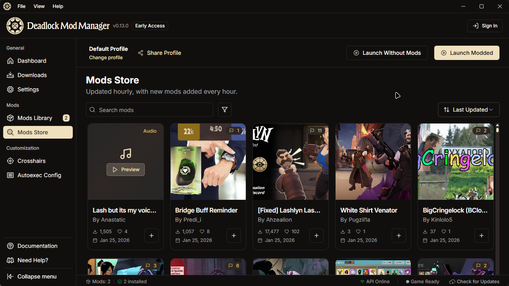

<!-- Improved compatibility of back to top link: See: https://github.com/othneildrew/Best-README-Template/pull/73 -->

<h1> Deadlock Mod Manager</h1>

<!-- Project Stats -->

[![Downloads][downloads-status]][downloads-url]
[![Contributors][contributors-status]][contributors-url]
[![GitHub Release][release-status]][release-url]
[![GitHub Issues or Pull Requests][issues-status]][issues-url]

[![License][license-status]][license-url]

[![Built with Tauri][tauri-status]][tauri-url]

 

  

  <h3 align="center">Deadlock Mod Manager</h3>

  

    Ein Mod-Manager für das Valve-Spiel Deadlock, entwickelt mit Tauri, React und TypeScript.
     
     
    <a href="https://github.com/deadlock-mod-manager/deadlock-mod-manager/releases/latest">Herunterladen</a>
    ·
    <a href="https://docs.deadlockmods.app/">Dokumentation</a>
    ·
    <a href="https://github.com/deadlock-mod-manager/deadlock-mod-manager/issues/new?labels=bug&template=bug-report---.md">Fehler melden</a>
    ·
    <a href="https://github.com/deadlock-mod-manager/deadlock-mod-manager/issues/new?labels=enhancement&template=feature-request---.md">Feature anfordern</a>
  

  
<!-- Distribution & Platforms -->
[![Windows][windows-status]][windows-url]
[![macOS][macos-status]][macos-url]
[![Linux][linux-status]][linux-url]
[![AUR][aur-status]][aur-url]

  
  

 

<!-- INHALTSVERZEICHNIS -->

  
Inhaltsverzeichnis

  <ol>
    <li><a href="#verwendung">Verwendung</a></li>
    <li><a href="#entwicklung">Entwicklung</a></li>
    <li><a href="#übersetzung--lokalisierung">Übersetzung & Lokalisierung</a></li>
    <li><a href="#mitwirken">Mitwirken</a></li>
    <li><a href="#lizenz">Lizenz</a></li>
    <li><a href="#kontakt">Kontakt</a></li>
    <li><a href="#danksagungen">Danksagungen</a></li>
    <li><a href="#sponsoren">Sponsoren</a></li>
  </ol>

## Verwendung

Für detaillierte Installationsanleitungen, Erste-Schritte-Guides, Fehlerbehebung und Funktionsdokumentation besuchen Sie bitte unsere umfassende Dokumentation:

**[Spieler-Guide](https://docs.deadlockmods.app/using-mod-manager)** - Installation, Verwendung und Fehlerbehebung

Für Hilfe und Support:

- [Vollständige Dokumentation](https://docs.deadlockmods.app/)
- [Discord-Community](https://deadlockmods.app/discord)
- [Probleme melden](https://github.com/deadlock-mod-manager/deadlock-mod-manager/issues)

## Entwicklung

Für Entwicklungssetup, Projektarchitektur, Beitragsrichtlinien und API-Integrationsdokumentation besuchen Sie bitte:

- **[Entwickler-Dokumentation](https://docs.deadlockmods.app/developer-docs)** - Entwicklungssetup und Architektur
- **[API-Referenz](https://docs.deadlockmods.app/api)** - Interaktive API-Dokumentation

## Übersetzung & Lokalisierung

🌍 **Helfen Sie uns, den Deadlock Mod Manager zu übersetzen!**

Wir arbeiten aktiv daran, den Deadlock Mod Manager für Nutzer weltweit zugänglich zu machen. Unterstützen Sie unsere Übersetzungsbemühungen und helfen Sie dabei, den Mod Manager in Ihre Sprache zu bringen!

  
<strong>Aktuell unterstützte Sprachen</strong>

<!-- LANGUAGE_TABLE_START -->

| Language | Native Name | Status | Contributors |
|----------|-------------|--------|-------------|
| 🇺🇸 **English** (Default) | English | ✅ Complete | - |
| 🇧🇬 **Bulgarian** | Български | ✅ Complete | [macchiako](https://discordapp.com/users/macchiako./) |
| 🇩🇪 **German** | Deutsch | ✅ Complete | [skeptic](https://github.com/Skeptic-systems) |
| 🇫🇷 **French** | Français | ✅ Complete | [stormix](https://github.com/stormix) |
| 🇷🇺 **Russian** | Русский | ✅ Complete | [awkward_akio](https://discordapp.com/users/awkward_akio/), [Thyron](https://github.com/baka-thyron) |
| 🇸🇦 **Arabic** | العربية | ✅ Complete | [archeroflegend](https://discordapp.com/users/archeroflegend/) |
| 🇵🇱 **Polish** | Polski | ✅ Complete | [_manio](https://discordapp.com/users/_manio/) |
| 🇨🇭 **Swiss German** | Schwiizerdütsch | ✅ Complete | [degoods_deedos](https://discordapp.com/users/degoods_deedos/) |
| 🇹🇭 **Thai** | ไทย | ✅ Complete | [altqx](https://discordapp.com/users/altq/) |
| 🇹🇷 **Turkish** | Türkçe | ✅ Complete | [kenanala](https://discordapp.com/users/kenanala/) |
| 🇨🇳 **Chinese (Simplified)** | 简体中文 | ✅ Complete | [待到春深方挽柳](mailto:sfk_04@qq.com) |
| 🇹🇼 **Chinese (Traditional)** | 繁體中文 | ✅ Complete | [白雲](https://github.com/phillychi3) |
| 🇪🇸 **Spanish** | Español | ✅ Complete | [chikencio](https://discordapp.com/users/chikencio/) |
| 🇧🇷 **Portuguese (Brazil)** | Português (Brasil) | ✅ Complete | [meneee](https://discordapp.com/users/meneee/) |
| 🇮🇹 **Italian** | Italiano | ✅ Complete | [Constrat](https://github.com/Constrat) |
| 🇯🇵 **Japanese** | 日本語 | ✅ Complete | [hiropiki](https://discordapp.com/users/hiropiki/) |

<!-- LANGUAGE_TABLE_END -->

### Wie Sie helfen können

1. **Treten Sie unserem Discord-Server bei**: Zuerst [treten Sie unserem Discord-Server bei](https://deadlockmods.app/discord), um auf die Übersetzungskanäle zuzugreifen
2. **Besuchen Sie den Übersetzungskanal**: Gehen Sie zum [#translations](https://discord.com/channels/1322369530386710568/1414203136939135067) Kanal
3. **Schlagen Sie eine neue Sprache vor**: Öffnen Sie ein Issue, um Unterstützung für Ihre Sprache anzufordern
4. **Verbessern Sie bestehende Übersetzungen**: Fehler gefunden oder bessere Formulierung? Reichen Sie einen PR ein!

Die Übersetzungsdateien befinden sich in `apps/desktop/public/locales/` - wir verwenden [react-i18next](https://react.i18next.com/) für die Internationalisierung.

## Mitwirken

Beiträge sind es, die die Open-Source-Community zu einem so großartigen Ort machen, um zu lernen, zu inspirieren und zu schaffen. Jeder Beitrag, den Sie leisten, wird **sehr geschätzt**.

Für umfassende Beitragsrichtlinien, Entwicklungssetup, Code-Stil-Standards und Best Practices siehe:

- **[CONTRIBUTING.md](CONTRIBUTING.md)**
- **[Beitrags-Dokumentation](https://docs.deadlockmods.app/developer-docs/contributing)**

### Top-Beitragende:

(<a href="#readme-top">nach oben</a>)

## Lizenz

Dieses Projekt steht unter der GNU General Public License v3.0 - siehe die [LICENSE.md](LICENSE.md) Datei für Details.

**Haftungsausschluss:** Dieses Projekt steht nicht in Verbindung mit Valve Corporation. Deadlock und das Deadlock-Logo sind eingetragene Marken von Valve Corporation.

## Kontakt

- **Projekt-Repository**: [GitHub](https://github.com/deadlock-mod-manager/deadlock-mod-manager)
- **Issues & Fehlermeldungen**: [GitHub Issues](https://github.com/deadlock-mod-manager/deadlock-mod-manager/issues)
- **Feature-Anfragen**: [GitHub Discussions](https://github.com/deadlock-mod-manager/deadlock-mod-manager/discussions)
- **Discord-Community**: [Treten Sie unserem Discord bei](https://deadlockmods.app/discord)
- **Autor**: [Stormix](https://github.com/Stormix)

Für Support und Fragen verwenden Sie bitte GitHub Issues oder treten Sie unserer Discord-Community bei. Wir helfen gerne!

<!-- ACKNOWLEDGMENTS -->

## Danksagungen

Dieses Projekt war nur dank der großartigen Open-Source-Community möglich, insbesondere:

### Besonderer Dank

- **[GameBanana](https://gamebanana.com/)** - Unsere primäre Mod-Quelle und das Rückgrat dieser Anwendung. GameBanana bietet die umfassende Mod-Datenbank und API, die das Durchsuchen, Entdecken und Herunterladen von Deadlock-Mods ermöglicht. Dieses Projekt würde ohne ihre hervorragende Plattform und community-gesteuerte Inhalte nicht existieren.

### Open-Source-Bibliotheken

- [Phosphor Icons](https://phosphoricons.com/)
- [React Icons](https://react-icons.github.io/react-icons/search)
- [shadcn/ui](https://ui.shadcn.com/)
- [Tauri](https://tauri.app/)
- [Hono](https://hono.dev/)
- [Bun](https://bun.sh/)
- [Drizzle ORM](https://orm.drizzle.team/)
- [shadcn/ui](https://ui.shadcn.com/)

## Sponsoren

  

  Kostenlose Code-Signierung unter Windows bereitgestellt von <a href="https://signpath.io/?utm_source=foundation&utm_medium=github&utm_campaign=deadlock-mod-manager">SignPath.io</a> 
  Zertifikat von <a href="https://signpath.org/?utm_source=foundation&utm_medium=github&utm_campaign=deadlock-mod-manager">SignPath Foundation</a>

(<a href="#readme-top">nach oben</a>)

[downloads-status]: https://img.shields.io/github/downloads/stormix/deadlock-modmanager/latest/total
[downloads-url]: https://github.com/deadlock-mod-manager/deadlock-mod-manager/releases/latest
[stars-status]: https://img.shields.io/github/stars/stormix/deadlock-modmanager
[stars-url]: https://github.com/deadlock-mod-manager/deadlock-mod-manager/stargazers
[release-status]: https://img.shields.io/github/v/release/stormix/deadlock-modmanager
[release-url]: https://github.com/deadlock-mod-manager/deadlock-mod-manager/releases/latest
[issues-status]: https://img.shields.io/github/issues/stormix/deadlock-modmanager
[issues-url]: https://github.com/deadlock-mod-manager/deadlock-mod-manager/issues
[license-status]: https://img.shields.io/github/license/stormix/deadlock-modmanager
[license-url]: https://github.com/deadlock-mod-manager/deadlock-mod-manager/blob/main/LICENSE.md
[aur-status]: https://img.shields.io/aur/version/deadlock-modmanager
[aur-url]: https://aur.archlinux.org/packages/deadlock-modmanager
[tauri-status]: https://img.shields.io/badge/built_with-Tauri-24C8DB?logo=tauri
[tauri-url]: https://tauri.app/
[typescript-status]: https://img.shields.io/badge/typescript-007ACC?logo=typescript&logoColor=white
[typescript-url]: https://www.typescriptlang.org/
[rust-status]: https://img.shields.io/badge/rust-000000?logo=rust&logoColor=white
[rust-url]: https://www.rust-lang.org/
[commit-activity-status]: https://img.shields.io/github/commit-activity/m/stormix/deadlock-modmanager
[commit-activity-url]: https://github.com/deadlock-mod-manager/deadlock-mod-manager/graphs/commit-activity
[last-commit-status]: https://img.shields.io/github/last-commit/stormix/deadlock-modmanager
[last-commit-url]: https://github.com/deadlock-mod-manager/deadlock-mod-manager/commits/main
[contributors-status]: https://img.shields.io/github/contributors/stormix/deadlock-modmanager
[contributors-url]: https://github.com/deadlock-mod-manager/deadlock-mod-manager/graphs/contributors
[forks-status]: https://img.shields.io/github/forks/stormix/deadlock-modmanager
[forks-url]: https://github.com/deadlock-mod-manager/deadlock-mod-manager/network/members
[windows-status]: https://img.shields.io/badge/Windows-0078D6?logo=windows&logoColor=white
[windows-url]: https://github.com/deadlock-mod-manager/deadlock-mod-manager/releases/latest
[macos-status]: https://img.shields.io/badge/macOS-000000?logo=apple&logoColor=white
[macos-url]: https://github.com/deadlock-mod-manager/deadlock-mod-manager/releases/latest
[linux-status]: https://img.shields.io/badge/Linux-FCC624?logo=linux&logoColor=black
[linux-url]: https://github.com/deadlock-mod-manager/deadlock-mod-manager/releases/latest
