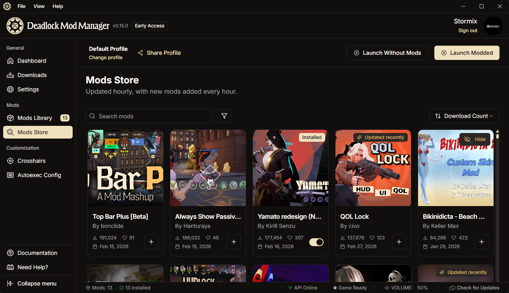
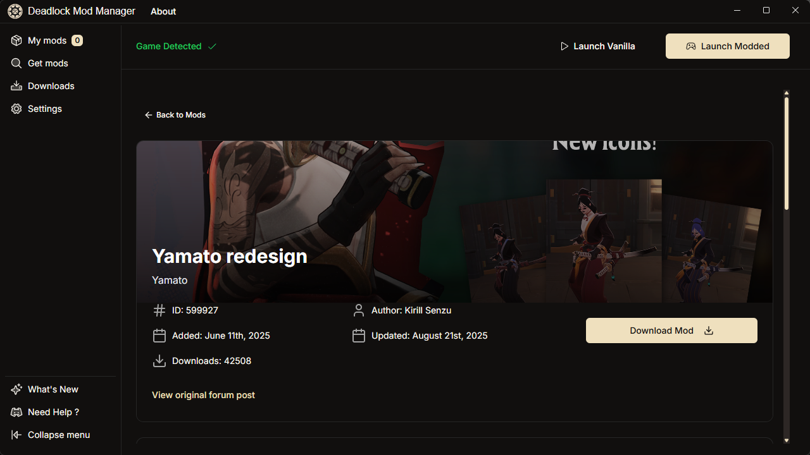
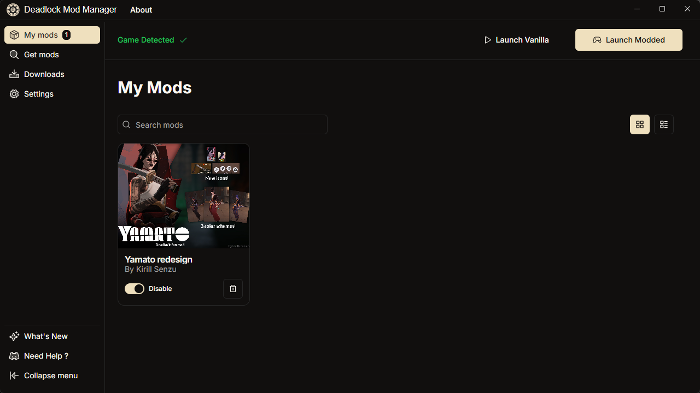
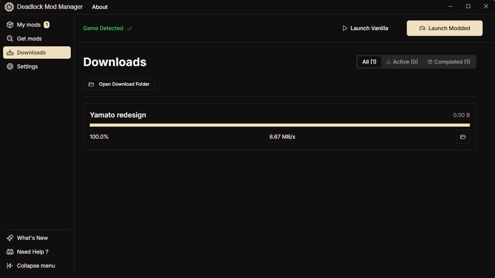
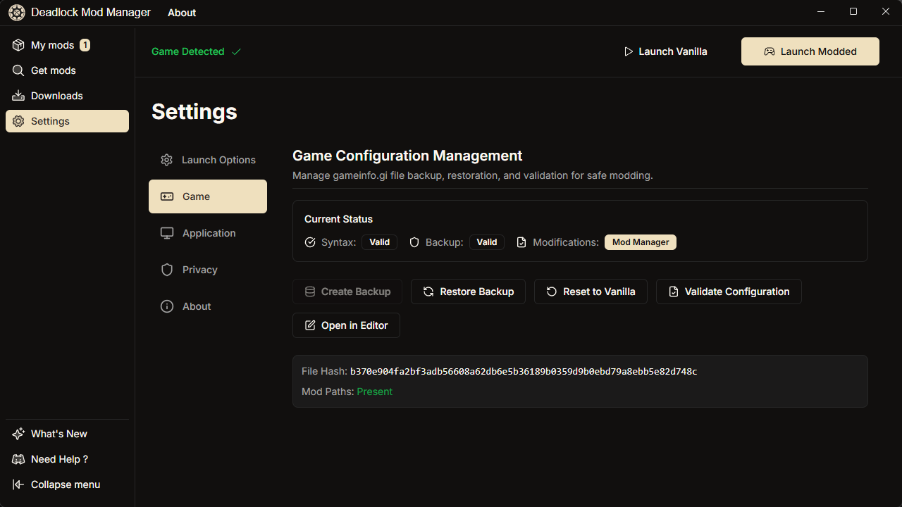
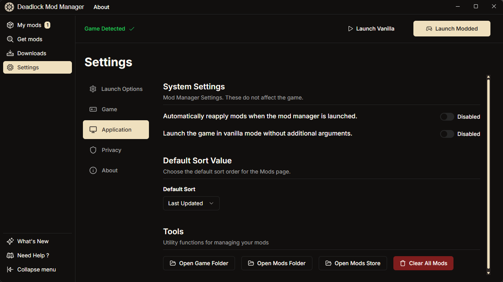

<!-- Improved compatibility of back to top link: See: https://github.com/othneildrew/Best-README-Template/pull/73 -->

<h1> Deadlock Mod Manager</h1>

<!-- Project Stats -->

[![Downloads][downloads-status]][downloads-url]
[![Contributors][contributors-status]][contributors-url]
[![GitHub Release][release-status]][release-url]
[![GitHub Issues or Pull Requests][issues-status]][issues-url]

[![License][license-status]][license-url]

[![Built with Tauri][tauri-status]][tauri-url]

 

  

  <h3 align="center">Deadlock Mod Manager</h3>

  

    Un gestionnaire de mods pour le jeu Deadlock de Valve, développé avec Tauri, React et TypeScript.
     
     
    <a href="https://github.com/stormix/deadlock-modmanager/releases/latest">Télécharger</a>
    ·
    <a href="https://docs.deadlockmods.app/">Documentation</a>
    ·
    <a href="https://github.com/stormix/deadlock-modmanager/issues/new?labels=bug&template=bug-report---.md">Signaler un Bug</a>
    ·
    <a href="https://github.com/stormix/deadlock-modmanager/issues/new?labels=enhancement&template=feature-request---.md">Demander une Fonctionnalité</a>
  

  
<!-- Distribution & Platforms -->
[![Windows][windows-status]][windows-url]
[![macOS][macos-status]][macos-url]
[![Linux][linux-status]][linux-url]
[![AUR][aur-status]][aur-url]

  
  

 

<!-- TABLE DES MATIERES -->

  
Table des Matières

  <ol>
    <li><a href="#captures-décran">Captures d'écran</a></li>
    <li><a href="#utilisation">Utilisation</a></li>
    <li><a href="#quest-ce-qui-est-inclus">Qu'est-ce qui est inclus ?</a></li>
    <li>
      <a href="#commencer">Commencer</a>
      <ul>
        <li><a href="#prérequis">Prérequis</a></li>
        <li><a href="#installation">Installation</a></li>
        <li><a href="#développement">Développement</a></li>
      </ul>
    </li>
    <li><a href="#contribuer">Contribuer</a></li>
    <li><a href="#licence">Licence</a></li>
    <li><a href="#contact">Contact</a></li>
    <li><a href="#remerciements">Remerciements</a></li>
  </ol>

## Captures d'écran

Cliquez pour voir les captures d'écran

### Application Principale

### Navigateur de Mods

### Pages de Mods Individuelles

### Processus d'Installation

### Page Mes Mods

### Gestion des Téléchargements

### Paramètres

## Utilisation

Pour des instructions d'installation détaillées, des guides de démarrage, le dépannage et la documentation des fonctionnalités, veuillez consulter notre documentation complète :

📖 **[Guide Joueur](https://docs.deadlockmods.app/using-mod-manager)** - Installation, utilisation et dépannage

Pour l'aide et le support :

- 📚 [Documentation Complète](https://docs.deadlockmods.app/)
- 💬 [Communauté Discord](https://discord.gg/WbFNt8CCr8)
- 🐛 [Signaler des Problèmes](https://github.com/stormix/deadlock-modmanager/issues)

## Qu'est-ce qui est inclus ?

Ce monorepo inclut les paquets/applications suivants :

### Applications

- `web` : Une application web [Next.js](https://nextjs.org/) qui fournit des informations sur le projet et le statut
- `desktop` : Une application de bureau [Tauri](https://tauri.app/) + React (le gestionnaire de mods principal)
- `api` : Un serveur API [Bun](https://bun.sh/) + [Hono](https://hono.dev/) qui synchronise les données de mods depuis GameBanana

### Paquets

- `@deadlock-mods/database` : Wrapper [Drizzle ORM](https://orm.drizzle.team/) pour gérer et accéder à la base de données
- `@deadlock-mods/shared` : Utilitaires partagés et définitions de types

- `@deadlock-mods/typescript-config` : Configurations TypeScript

## Développement

Pour la configuration du développement, l'architecture du projet, les directives de contribution et la documentation d'intégration API, veuillez consulter :

🔧 **[Documentation Développeur](https://docs.deadlockmods.app/developer-docs)** - Configuration du développement et architecture  
🔌 **[Référence API](https://docs.deadlockmods.app/api)** - Documentation API interactive

## Traduction & Localisation

🌍 **Aidez-nous à traduire Deadlock Mod Manager !**

Nous travaillons activement pour rendre Deadlock Mod Manager accessible aux utilisateurs du monde entier. Rejoignez nos efforts de traduction et aidez à apporter le gestionnaire de mods dans votre langue !

### Langues actuellement supportées

<!-- LANGUAGE_TABLE_START -->

| Language | Native Name | Status | Contributors |
|----------|-------------|--------|-------------|
| 🇺🇸 **English** (Default) | English | ✅ Complete | - |
| 🇩🇪 **German** | Deutsch | ✅ Complete | [skeptic](https://discordapp.com/users/__skeptic__/) |
| 🇫🇷 **French** | Français | ✅ Complete | [stormix](https://github.com/stormix) |
| 🇷🇺 **Russian** | Русский | ✅ Complete | [awkward_akio](https://discordapp.com/users/awkward_akio/), [Thyron](https://github.com/baka-thyron) |
| 🇸🇦 **Arabic** | العربية | ✅ Complete | [archeroflegend](https://discordapp.com/users/archeroflegend/) |
| 🇵🇱 **Polish** | Polski | ✅ Complete | [_manio](https://discordapp.com/users/_manio/) |
| 🇨🇭 **Swiss German** | Schwiizerdütsch | ✅ Complete | [degoods_deedos](https://discordapp.com/users/degoods_deedos/) |
| 🇹🇭 **Thai** | ไทย | ✅ Complete | [altqx](https://discordapp.com/users/altq/) |
| 🇹🇷 **Turkish** | Türkçe | ✅ Complete | [kenanala](https://discordapp.com/users/kenanala/) |
| 🇨🇳 **Chinese (Simplified)** | 简体中文 | ✅ Complete | [待到春深方挽柳](mailto:sfk_04@qq.com) |
| 🇹🇼 **Chinese (Traditional)** | 繁體中文 | ✅ Complete | [白雲](https://github.com/phillychi3) |
| 🇪🇸 **Spanish** | Español | ✅ Complete | [chikencio](https://discordapp.com/users/chikencio/) |
| 🇧🇷 **Portuguese (Brazil)** | Português (Brasil) | ✅ Complete | [meneee](https://discordapp.com/users/meneee/) |

<!-- LANGUAGE_TABLE_END -->

### Comment aider

1. **Rejoignez notre serveur Discord** : D'abord [rejoignez notre serveur Discord](https://discord.gg/WbFNt8CCr8) pour accéder aux canaux de traduction
2. **Visitez le canal de traduction** : Allez sur le canal [#translations](https://discord.com/channels/1322369530386710568/1414203136939135067)
3. **Suggérez une nouvelle langue** : Ouvrez une issue pour demander le support de votre langue
4. **Améliorez les traductions existantes** : Trouvé une erreur ou une meilleure formulation ? Soumettez une PR !

Les fichiers de traduction se trouvent dans `apps/desktop/public/locales/` - nous utilisons [react-i18next](https://react.i18next.com/) pour l'internationalisation.

---

## Contributing

Contributions are what make the open source community such an amazing place to learn, inspire, and create. Any contributions you make are **greatly appreciated**.

If you have a suggestion that would make this better, please fork the repo and create a pull request. You can also simply open an issue with the tag "enhancement".
Don't forget to give the project a star! Thanks again!

1. Fork the Project
2. Create your Feature Branch (`git checkout -b feature/AmazingFeature`)
3. Commit your Changes (`git commit -m 'feat: add some AmazingFeature'`)
4. Push to the Branch (`git push origin feature/AmazingFeature`)
5. Open a Pull Request

### Top contributors:

(<a href="#readme-top">back to top</a>)

## License

This project is licensed under the GNU General Public License v3.0 - see the [LICENSE.md](LICENSE.md) file for details.

**Disclaimer:** This project is not affiliated with Valve Corporation. Deadlock and the Deadlock logo are registered trademarks of Valve Corporation.

## Contact

- **Project Repository**: [GitHub](https://github.com/stormix/deadlock-modmanager)
- **Issues & Bug Reports**: [GitHub Issues](https://github.com/stormix/deadlock-modmanager/issues)
- **Feature Requests**: [GitHub Discussions](https://github.com/stormix/deadlock-modmanager/discussions)
- **Discord Community**: [Join our Discord](https://discord.gg/WbFNt8CCr8)
- **Author**: [Stormix](https://github.com/Stormix)

For support and questions, please use GitHub Issues or join our Discord community. We're always happy to help!

<!-- ACKNOWLEDGMENTS -->

## Acknowledgments

This project was only possible thanks to the amazing open source community, especially:

### Special Thanks

- **[GameBanana](https://gamebanana.com/)** - Our primary mod source and the backbone of this application. GameBanana provides the comprehensive mod database and API that makes browsing, discovering, and downloading Deadlock mods possible. This project would not exist without their excellent platform and community-driven content.

### Open Source Libraries

- [Phosphor Icons](https://phosphoricons.com/)
- [React Icons](https://react-icons.github.io/react-icons/search)
- [shadcn/ui](https://ui.shadcn.com/)
- [Tauri](https://tauri.app/)
- [Hono](https://hono.dev/)
- [Bun](https://bun.sh/)
- [Drizzle ORM](https://orm.drizzle.team/)
- [shadcn/ui](https://ui.shadcn.com/)

(<a href="#readme-top">back to top</a>)

[downloads-status]: https://img.shields.io/github/downloads/stormix/deadlock-modmanager/latest/total
[downloads-url]: https://github.com/stormix/deadlock-modmanager/releases/latest
[release-status]: https://img.shields.io/github/v/release/stormix/deadlock-modmanager
[release-url]: https://github.com/stormix/deadlock-modmanager/releases/latest
[issues-status]: https://img.shields.io/github/issues/stormix/deadlock-modmanager
[issues-url]: https://github.com/stormix/deadlock-modmanager/issues
[license-status]: https://img.shields.io/github/license/stormix/deadlock-modmanager
[license-url]: https://github.com/stormix/deadlock-modmanager/blob/main/LICENSE.md
[aur-status]: https://img.shields.io/aur/version/deadlock-modmanager
[aur-url]: https://aur.archlinux.org/packages/deadlock-modmanager
[tauri-status]: https://img.shields.io/badge/built_with-Tauri-24C8DB?logo=tauri
[tauri-url]: https://tauri.app/
[contributors-status]: https://img.shields.io/github/contributors/stormix/deadlock-modmanager
[contributors-url]: https://github.com/stormix/deadlock-modmanager/graphs/contributors
[windows-status]: https://img.shields.io/badge/Windows-0078D6?logo=windows&logoColor=white
[windows-url]: https://github.com/stormix/deadlock-modmanager/releases/latest
[macos-status]: https://img.shields.io/badge/macOS-000000?logo=apple&logoColor=white
[macos-url]: https://github.com/stormix/deadlock-modmanager/releases/latest
[linux-status]: https://img.shields.io/badge/Linux-FCC624?logo=linux&logoColor=black
[linux-url]: https://github.com/stormix/deadlock-modmanager/releases/latest
