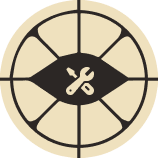
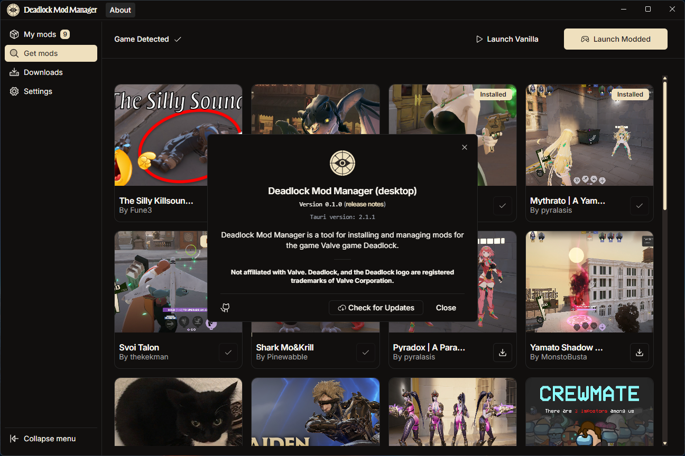

<!-- Improved compatibility of back to top link: See: https://github.com/othneildrew/Best-README-Template/pull/73 -->

<a id="readme-top"></a>

# Deadlock Mod Manager [![Built with Tauri][tauri-status]][tauri-url]

<!-- Project Stats -->

[![Downloads][downloads-status]][downloads-url]
[![Contributors][contributors-status]][contributors-url]
[![GitHub Release][release-status]][release-url]
[![GitHub Issues or Pull Requests][issues-status]][issues-url]
[](https://uptime.betterstack.com/?utm_source=status_badge)
[![License][license-status]][license-url]

<br />
<div align="center">
  <a href="https://github.com/stormix/deadlock-modmanager">
    
  </a>

  <h3 align="center">Deadlock Mod Manager</h3>

  <p align="center">
    A mod manager for the Valve game Deadlock, built with Tauri, React, and TypeScript.
    <br />
    <br />
    <a href="https://github.com/stormix/deadlock-modmanager/releases/latest">Download</a>
    ·
    <a href="https://github.com/stormix/deadlock-modmanager/issues/new?labels=bug&template=bug-report---.md">Report Bug</a>
    ·
    <a href="https://github.com/stormix/deadlock-modmanager/issues/new?labels=enhancement&template=feature-request---.md">Request Feature</a>
  </p>
  
<!-- Distribution & Platforms -->
[![Windows][windows-status]][windows-url]
[![macOS][macos-status]][macos-url]
[![Linux][linux-status]][linux-url]
[![AUR][aur-status]][aur-url]

  
  
</div>

<br />

<!-- TABLE OF CONTENTS -->
<details>
  <summary>Table of Contents</summary>
  <ol>
    <li><a href="#screenshots">Screenshots</a></li>
    <li><a href="#usage">Usage</a></li>
    <li><a href="#whats-inside">What's inside?</a></li>
    <li>
      <a href="#getting-started">Getting Started</a>
      <ul>
        <li><a href="#prerequisites">Prerequisites</a></li>
        <li><a href="#installation">Installation</a></li>
        <li><a href="#development">Development</a></li>
      </ul>
    </li>
    <li><a href="#contributing">Contributing</a></li>
    <li><a href="#license">License</a></li>
    <li><a href="#contact">Contact</a></li>
    <li><a href="#acknowledgments">Acknowledgments</a></li>
  </ol>
</details>

## Screenshots

<details>
<summary>Click to view screenshots</summary>

### About Dialog



### Download Page


### My Mods Page


### Mods Browser


</details>

## Usage

### For End Users

1. **Download the Application**

   - Visit the [releases page](https://github.com/stormix/deadlock-modmanager/releases/latest)
   - Download the appropriate installer for your operating system (Windows, macOS, or Linux)
   - Run the installer and follow the setup instructions

   **Alternative Installation (Windows)**

   - **Windows users**: Install via winget:
     ```bash
     winget install --id=Stormix.DeadlockModManager
     ```

   **Alternative Installation (Linux)**

   - **Arch Linux users**: Install from the AUR using your preferred AUR helper:

     ```bash
     # Latest stable release
     yay -S deadlock-modmanager

     # Latest development build
     yay -S deadlock-modmanager-git
     ```

   **Linux Compatibility Note**

   - **Wayland + NVIDIA users**: If you experience issues with the application not displaying correctly or crashing on Wayland with NVIDIA GPUs, run the application with:
     ```bash
     WEBKIT_DISABLE_COMPOSITING_MODE=1 deadlock-modmanager
     ```
     This resolves a known issue with webkit2gtk on NVIDIA drivers. AUR users have this automatically handled in the .desktop file.

2. **First Time Setup**

   - Launch the Deadlock Mod Manager
   - The application will automatically detect your Deadlock installation
   - If not detected automatically, you can manually set the game directory in Settings

3. **Browse and Install Mods**

   - Browse available mods in the "Mods" tab
   - Use the search functionality to find specific mods
   - Click "Download" on any mod you want to install
   - The mod will be automatically downloaded and installed

4. **Manage Your Mods**
   - View your installed mods in the "My Mods" tab
   - Enable/disable mods as needed
   - Uninstall mods you no longer want
   - Update outdated mods when new versions are available

## What's inside?

This monorepo includes the following packages/apps:

### Apps

- `web`: A [Next.js](https://nextjs.org/) web application that provides project information and status
- `desktop`: A [Tauri](https://tauri.app/) + React desktop application (the main mod manager)
- `api`: A [Bun](https://bun.sh/) + [Hono](https://hono.dev/) API server that syncs mod data from GameBanana

### Packages

- `@deadlock-mods/database`: [Drizzle ORM](https://orm.drizzle.team/) wrapper to manage & access the database
- `@deadlock-mods/utils`: Shared utilities and type definitions

- `@deadlock-mods/typescript-config`: TypeScript configurations

## Getting Started

### Prerequisites

- Node.js >= 18
- pnpm
- Docker (for local database)
- Rust (for desktop app)

### Installation

1. Install dependencies:

```bash
pnpm install
```

2. Set up the database:

```bash
# Start the database (requires Docker)
docker-compose up -d
```

3. Run the migrations:

```bash
pnpm db:push
```

4. Run the API server:

```bash
pnpm api:dev
```

5. Run the desktop app:

```bash
pnpm desktop:dev
```

### Development

To develop all apps and packages:

```bash
pnpm dev
```

## Contributing

Contributions are what make the open source community such an amazing place to learn, inspire, and create. Any contributions you make are **greatly appreciated**.

If you have a suggestion that would make this better, please fork the repo and create a pull request. You can also simply open an issue with the tag "enhancement".
Don't forget to give the project a star! Thanks again!

1. Fork the Project
2. Create your Feature Branch (`git checkout -b feature/AmazingFeature`)
3. Commit your Changes (`git commit -m 'feat: add some AmazingFeature'`)
4. Push to the Branch (`git push origin feature/AmazingFeature`)
5. Open a Pull Request

### Top contributors:

<a href="https://github.com/stormix/deadlock-modmanager/graphs/contributors">
  
</a>

<p align="right">(<a href="#readme-top">back to top</a>)</p>

## License

This project is licensed under the GNU General Public License v3.0 - see the [LICENSE.md](LICENSE.md) file for details.

**Disclaimer:** This project is not affiliated with Valve Corporation. Deadlock and the Deadlock logo are registered trademarks of Valve Corporation.

## Contact

- **Project Repository**: [GitHub](https://github.com/stormix/deadlock-modmanager)
- **Issues & Bug Reports**: [GitHub Issues](https://github.com/stormix/deadlock-modmanager/issues)
- **Feature Requests**: [GitHub Discussions](https://github.com/stormix/deadlock-modmanager/discussions)
- **Discord Community**: [Join our Discord](https://discord.gg/KSB2kzQWWE)
- **Author**: [Stormix](https://github.com/Stormix)

For support and questions, please use GitHub Issues or join our Discord community. We're always happy to help!

<!-- ACKNOWLEDGMENTS -->

## Acknowledgments

This project was only possible thanks to the amazing open source community, especially:

### Special Thanks

- **[GameBanana](https://gamebanana.com/)** - Our primary mod source and the backbone of this application. GameBanana provides the comprehensive mod database and API that makes browsing, discovering, and downloading Deadlock mods possible. This project would not exist without their excellent platform and community-driven content.

### Open Source Libraries

- [Phosphor Icons](https://phosphoricons.com/)
- [React Icons](https://react-icons.github.io/react-icons/search)
- [shadcn/ui](https://ui.shadcn.com/)
- [Tauri](https://tauri.app/)
- [Hono](https://hono.dev/)
- [Bun](https://bun.sh/)
- [Drizzle ORM](https://orm.drizzle.team/)
- [shadcn/ui](https://ui.shadcn.com/)

<p align="right">(<a href="#readme-top">back to top</a>)</p>

[downloads-status]: https://img.shields.io/github/downloads/stormix/deadlock-modmanager/latest/total
[downloads-url]: https://github.com/stormix/deadlock-modmanager/releases/latest
[stars-status]: https://img.shields.io/github/stars/stormix/deadlock-modmanager
[stars-url]: https://github.com/stormix/deadlock-modmanager/stargazers
[release-status]: https://img.shields.io/github/v/release/stormix/deadlock-modmanager
[release-url]: https://github.com/stormix/deadlock-modmanager/releases/latest
[issues-status]: https://img.shields.io/github/issues/stormix/deadlock-modmanager
[issues-url]: https://github.com/stormix/deadlock-modmanager/issues
[license-status]: https://img.shields.io/github/license/stormix/deadlock-modmanager
[license-url]: https://github.com/stormix/deadlock-modmanager/blob/main/LICENSE.md
[aur-status]: https://img.shields.io/aur/version/deadlock-modmanager
[aur-url]: https://aur.archlinux.org/packages/deadlock-modmanager
[tauri-status]: https://img.shields.io/badge/built_with-Tauri-24C8DB?logo=tauri
[tauri-url]: https://tauri.app/
[typescript-status]: https://img.shields.io/badge/typescript-007ACC?logo=typescript&logoColor=white
[typescript-url]: https://www.typescriptlang.org/
[rust-status]: https://img.shields.io/badge/rust-000000?logo=rust&logoColor=white
[rust-url]: https://www.rust-lang.org/
[commit-activity-status]: https://img.shields.io/github/commit-activity/m/stormix/deadlock-modmanager
[commit-activity-url]: https://github.com/stormix/deadlock-modmanager/graphs/commit-activity
[last-commit-status]: https://img.shields.io/github/last-commit/stormix/deadlock-modmanager
[last-commit-url]: https://github.com/stormix/deadlock-modmanager/commits/main
[contributors-status]: https://img.shields.io/github/contributors/stormix/deadlock-modmanager
[contributors-url]: https://github.com/stormix/deadlock-modmanager/graphs/contributors
[forks-status]: https://img.shields.io/github/forks/stormix/deadlock-modmanager
[forks-url]: https://github.com/stormix/deadlock-modmanager/network/members
[windows-status]: https://img.shields.io/badge/Windows-0078D6?logo=windows&logoColor=white
[windows-url]: https://github.com/stormix/deadlock-modmanager/releases/latest
[macos-status]: https://img.shields.io/badge/macOS-000000?logo=apple&logoColor=white
[macos-url]: https://github.com/stormix/deadlock-modmanager/releases/latest
[linux-status]: https://img.shields.io/badge/Linux-FCC624?logo=linux&logoColor=black
[linux-url]: https://github.com/stormix/deadlock-modmanager/releases/latest
