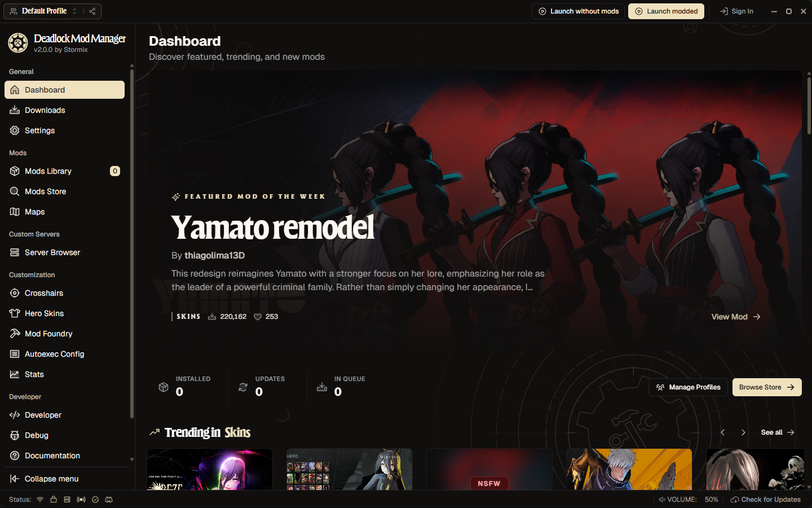

<!-- Improved compatibility of back to top link: See: https://github.com/othneildrew/Best-README-Template/pull/73 -->

<a id="readme-top"></a>

<div align="center">
<h1> Deadlock Mod Manager</h1>
</div>
<!-- Project Stats -->
<div align="center">

[![Downloads][downloads-status]][downloads-url]
[![Contributors][contributors-status]][contributors-url]
[![GitHub Release][release-status]][release-url]
[![GitHub Issues or Pull Requests][issues-status]][issues-url]
[](https://uptime.betterstack.com/?utm_source=status_badge)
[](https://deepwiki.com/deadlock-mod-manager/deadlock-mod-manager)
[](https://crowdin.com/project/deadlock-mod-manager)
[![License][license-status]][license-url]

[![Built with Tauri][tauri-status]][tauri-url]

</div>
<br />
<div align="center">
  <a href="https://github.com/deadlock-mod-manager/deadlock-mod-manager">
    
  </a>

  <h3 align="center">Deadlock Mod Manager</h3>

  <p align="center">
    A mod manager for the Valve game Deadlock, built with Tauri, React, and TypeScript.
    <br />
    <br />
    <a href="https://github.com/deadlock-mod-manager/deadlock-mod-manager/releases/latest">Download</a>
    ·
    <a href="https://docs.deadlockmods.app/">Documentation</a>
    ·
    <a href="https://github.com/deadlock-mod-manager/deadlock-mod-manager/issues/new?labels=bug&template=bug-report---.md">Report Bug</a>
    ·
    <a href="https://github.com/deadlock-mod-manager/deadlock-mod-manager/issues/new?labels=enhancement&template=feature-request---.md">Request Feature</a>
  </p>
  
<!-- Distribution & Platforms -->
[![Windows][windows-status]][windows-url]
[![winget][winget-status]][winget-url]
[![Linux][linux-status]][linux-url]
[![AUR][aur-status]][aur-url]
[![nixpkgs][nixpkgs-status]][nixpkgs-url]
[![Gentoo overlay][gentoo-status]][gentoo-url]

  
  
</div>

<!-- TABLE OF CONTENTS -->
<details>
  <summary>Table of Contents</summary>
  <ol>
    <li><a href="#features">Features</a></li>
    <li><a href="#installation">Installation</a></li>
    <li><a href="#usage">Usage</a></li>
    <li><a href="#sponsors">Sponsors</a></li>
    <li><a href="#development">Development</a></li>
    <li><a href="#translation--localization">Translation & Localization</a></li>
    <li><a href="#contributing">Contributing</a></li>
    <li><a href="#license">License</a></li>
    <li><a href="#contact">Contact</a></li>
    <li><a href="#acknowledgments">Acknowledgments</a></li>
  </ol>
</details>

## Features

- **Mods Store** - Browse the GameBanana catalog of mods, sounds, maps, and WIPs with search, hero and category filters, favorites, and sorting.
- **One-click installs** - Download mods, pick files or variants, and pause, resume, or retry downloads. Local mod files can be imported too.
- **Mods Library** - Enable, disable, reorder, update, and reinstall mods, with conflict warnings and backups.
- **Hero Skins** - Pick the active skin per hero, manage variants, and toggle sounds and other hero mods separately.
- **Profiles** - Keep separate mod setups and share them with friends using a Profile ID.
- **Mod Foundry** - Edit and build hero skins inside the app.
- **Customization** - Crosshair editor, autoexec config editor with a command library, and themes.
- **Server Browser and Stats** - Find community servers (required maps and addons are checked before joining) and view match, hero, and item stats.
- **Discord game presence** - Show what you're playing in Deadlock on Discord.

See the [features overview](https://docs.deadlockmods.app/using-mod-manager/features) for the full list.

## Installation

Download the latest installer for Windows or Linux (`.exe`, `.deb`, `.rpm`, `.flatpak`) from the [releases page](https://github.com/deadlock-mod-manager/deadlock-mod-manager/releases/latest), or use a package manager:

```bash
# Windows (winget)
winget install --id=Stormix.DeadlockModManager

# Arch Linux (AUR)
yay -S deadlock-modmanager

# nixpkgs
nix-shell -p deadlock-mod-manager --run deadlock-mod-manager

# Gentoo (third-party ::deftera overlay)
sudo eselect repository add deftera git https://github.com/Deftera186/deftera-overlay.git
sudo emaint sync --repo deftera
sudo emerge -av games-util/deadlock-modmanager-bin
```

See the [installation guide](https://docs.deadlockmods.app/using-mod-manager/installation) for platform-specific steps, CEF builds, and the development AUR package.

## Usage

For detailed installation instructions, getting started guides, troubleshooting, and feature documentation, please visit our comprehensive documentation:

**[Player Guide](https://docs.deadlockmods.app/using-mod-manager)** - Installation, usage, and troubleshooting

For help and support:

- [Full Documentation](https://docs.deadlockmods.app/)
- [Discord Community](https://deadlockmods.app/discord)
- [Report Issues](https://github.com/deadlock-mod-manager/deadlock-mod-manager/issues)

> [!WARNING]
> **Linux Support - Limited**
>
> Linux support is provided on a **best-effort basis**. Due to a lack of contributors with Linux expertise and the maintainer's limited experience distributing software across the many Linux distributions, you may encounter packaging issues, missing dependencies, or platform-specific bugs. If you're a Linux user and want to help improve support, contributions are very welcome! Please reach out on [Discord](https://deadlockmods.app/discord) or open a PR.

<br />

## Sponsors

<p align="center">
  <a href="https://neon.com/?utm_source=deadlock-mod-manager&utm_medium=github&utm_campaign=sponsor">
    
  </a>
</p>

<p align="center">
  Serverless Postgres provided by <a href="https://neon.com/?utm_source=deadlock-mod-manager&utm_medium=github&utm_campaign=sponsor">Neon</a>. Thanks for sponsoring Deadlock Mod Manager!
</p>

<br/>

<p align="center">
  <a href="https://signpath.io/?utm_source=foundation&utm_medium=github&utm_campaign=deadlock-mod-manager">
    
  </a>
</p>

<p align="center">
  Free code signing on Windows provided by <a href="https://signpath.io/?utm_source=foundation&utm_medium=github&utm_campaign=deadlock-mod-manager">SignPath.io</a><br/>
  Certificate by <a href="https://signpath.org/?utm_source=foundation&utm_medium=github&utm_campaign=deadlock-mod-manager">SignPath Foundation</a>
</p>

<br/>

<p align="center">
  <a href="https://crabnebula.dev/?utm_source=deadlock-mod-manager&utm_medium=github&utm_campaign=sponsor">
    
  </a>
</p>

<p align="center">
  Tauri tooling and distribution infrastructure provided by <a href="https://crabnebula.dev/?utm_source=deadlock-mod-manager&utm_medium=github&utm_campaign=sponsor">CrabNebula</a>. Thanks for sponsoring Deadlock Mod Manager!
</p>

<br/>

<p align="center">
  <a href="https://depot.dev/?utm_source=deadlock-mod-manager&utm_medium=github&utm_campaign=sponsor">
    
  </a>
</p>

<p align="center">
  Faster CI builds provided by <a href="https://depot.dev/?utm_source=deadlock-mod-manager&utm_medium=github&utm_campaign=sponsor">Depot</a>. Thanks for sponsoring Deadlock Mod Manager!
</p>

<p align="right">(<a href="#readme-top">back to top</a>)</p>

## Development

For development setup, project architecture, contributing guidelines, and API integration documentation, please visit:

- **[Developer Documentation](https://docs.deadlockmods.app/developer-docs)** - Development setup and architecture
- **[API Reference](https://docs.deadlockmods.app/api)** - Interactive API documentation

### Quick start

You need [Node.js](https://nodejs.org/) 24.8+, [pnpm](https://pnpm.io/), [Bun](https://bun.sh/) 1.4.2+, and [Rust](https://rustup.rs/) (stable), plus the [Tauri prerequisites](https://tauri.app/start/prerequisites/) for your platform (Visual Studio C++ Build Tools and WebView2 on Windows, WebKitGTK and friends on Linux).

```bash
git clone https://github.com/deadlock-mod-manager/deadlock-mod-manager.git
cd deadlock-mod-manager
pnpm install
pnpm desktop:dev
```

The desktop app talks to the production API by default, so you don't need a local database to work on it. To run the API, web app, and other services locally, follow the [development setup guide](https://docs.deadlockmods.app/developer-docs/development-setup) (Docker, `.env`, `pnpm db:push`).

### Development with Nix (Linux only)

[](https://nixos.org)

For Linux developers, we provide a complete Nix development environment:

```bash
# Clone and enter the project
git clone https://github.com/deadlock-mod-manager/deadlock-mod-manager.git
cd deadlock-mod-manager

# Start development shell (or use direnv for automatic loading)
nix develop

# Install dependencies and start
pnpm install
pnpm desktop:dev
```

The Nix environment includes everything you need: Rust, Node.js, pnpm, Docker, system libraries, and all development tools.

For detailed Nix setup instructions, see [CONTRIBUTING.md](CONTRIBUTING.md#development-with-nix).

## Translation & Localization

🌍 **Help us translate Deadlock Mod Manager!**

We're actively working to make Deadlock Mod Manager accessible to users worldwide. Join our translation efforts and help bring the mod manager to your language!

<details>
  <summary><strong>Currently Supported Languages</strong></summary>

<!-- LANGUAGE_TABLE_START -->

| Language | Native Name | Status | Contributors |
|----------|-------------|--------|-------------|
| 🇺🇸 **English** (Default) | English | ✅ Complete | - |
| 🇧🇬 **Bulgarian** | Български | 🚧 10% | [macchiako](https://discordapp.com/users/macchiako./) |
| 🇧🇾 **Belarusian** | Беларуская | 🚧 In Progress | [drodn](https://discordapp.com/users/drodn/) |
| 🇩🇪 **German** | Deutsch | 🚧 23% | [skeptic](https://github.com/Skeptic-systems) |
| 🇫🇷 **French** | Français | 🚧 16% | [stormix](https://github.com/stormix) |
| 🇷🇺 **Russian** | Русский | 🚧 1% | [awkward_akio](https://discordapp.com/users/awkward_akio/), [Thyron](https://github.com/baka-thyron) |
| 🇸🇦 **Arabic** | العربية | 🚧 23% | [archeroflegend](https://discordapp.com/users/archeroflegend/) |
| 🇵🇱 **Polish** | Polski | 🚧 50% | [_manio](https://discordapp.com/users/_manio/) |
| 🇨🇭 **Swiss German** | Schwiizerdütsch | 🚧 11% | [degoods_deedos](https://discordapp.com/users/degoods_deedos/) |
| 🇹🇭 **Thai** | ไทย | 🚧 17% | [altqx](https://discordapp.com/users/altq/) |
| 🇹🇷 **Turkish** | Türkçe | 🚧 13% | [kenanala](https://discordapp.com/users/kenanala/) |
| 🇨🇳 **Chinese (Simplified)** | 简体中文 | 🚧 62% | [待到春深方挽柳](mailto:sfk_04@qq.com) |
| 🇹🇼 **Chinese (Traditional)** | 繁體中文 | ✅ Complete | [白雲](https://github.com/phillychi3) |
| 🇪🇸 **Spanish** | Español | ✅ Complete | [chikencio](https://discordapp.com/users/chikencio/) |
| 🇧🇷 **Portuguese (Brazil)** | Português (Brasil) | 🚧 15% | [meneee](https://discordapp.com/users/meneee/) |
| 🇮🇹 **Italian** | Italiano | 🚧 15% | [Constrat](https://github.com/Constrat) |
| 🇯🇵 **Japanese** | 日本語 | 🚧 23% | [hiropiki](https://discordapp.com/users/hiropiki/) |
| 🇰🇷 **Korean** | 한국어 | 🚧 34% | [Quinnly_IRL](https://discordapp.com/users/Quinnly_IRL/) |

<!-- LANGUAGE_TABLE_END -->
</details>

### How to Help

All translations are managed on **[Crowdin](https://translate.deadlockmods.app/)**. Translations are synced back into this repository automatically via the [Crowdin GitHub action](.github/workflows/crowdin.yml), so you don't need to edit JSON files directly.

1. **Translate on Crowdin**: Head to [translate.deadlockmods.app](https://translate.deadlockmods.app/) and pick your language - approved translations are proposed as a PR automatically
2. **Join our Discord server**: [join our Discord server](https://deadlockmods.app/discord) and visit the [#translations](https://discord.com/channels/1322369530386710568/1414203136939135067) channel for coordination
3. **Suggest a new language**: Open a request on Crowdin, or [file an issue](https://github.com/deadlock-mod-manager/deadlock-mod-manager/issues/new) if the language isn't listed there

Translation files are located in `apps/desktop/src/locales/` and loaded via [react-i18next](https://react.i18next.com/). Only `en.json` is edited directly in the repo; all other locales are managed through Crowdin.

## Contributing

Contributions are what make the open source community such an amazing place to learn, inspire, and create. Any contributions you make are **greatly appreciated**.

For comprehensive contributing guidelines, development setup, code style standards, and best practices, please see:

- **[CONTRIBUTING.md](CONTRIBUTING.md)**
- **[Contributing Documentation](https://docs.deadlockmods.app/developer-docs/contributing)**

> **AI-Assisted Contributions:** We welcome AI-assisted contributions! Please review our [AI Policy](./AI_POLICY.md) for guidelines on disclosure and quality expectations.

### Top contributors:

<a href="https://github.com/deadlock-mod-manager/deadlock-mod-manager/graphs/contributors">
  
</a>

<p align="right">(<a href="#readme-top">back to top</a>)</p>

## License

This project is licensed under the GNU General Public License v3.0 - see the [LICENSE.md](LICENSE.md) file for details.

Vendored and copied-in third-party source (vpkmerge, ValveResourceFormat, shadcn/ui, and others) is documented in [THIRD-PARTY-NOTICES.md](THIRD-PARTY-NOTICES.md).

**Disclaimer:** This project is not affiliated with Valve Corporation. Deadlock and the Deadlock logo are registered trademarks of Valve Corporation.

## Contact

- **Project Repository**: [GitHub](https://github.com/deadlock-mod-manager/deadlock-mod-manager)
- **Issues & Bug Reports**: [GitHub Issues](https://github.com/deadlock-mod-manager/deadlock-mod-manager/issues)
- **Feature Requests**: [GitHub Discussions](https://github.com/deadlock-mod-manager/deadlock-mod-manager/discussions)
- **Discord Community**: [Join our Discord](https://deadlockmods.app/discord)
- **Author**: [Stormix](https://github.com/Stormix)

For support and questions, please use GitHub Issues or join our Discord community. We're always happy to help!

<!-- ACKNOWLEDGMENTS -->

## Acknowledgments

This project was only possible thanks to the amazing open source community, especially:

### Special Thanks

- **[GameBanana](https://gamebanana.com/)** - Our primary mod source and the backbone of this application. GameBanana provides the comprehensive mod database and API that makes browsing, discovering, and downloading Deadlock mods possible. This project would not exist without their excellent platform and community-driven content.
- **[Jelloge/Deadlock-Rich-Presence](https://github.com/Jelloge/Deadlock-Rich-Presence)** - Discord Game Presence was only possible thanks to this project and its work mapping Deadlock console log events for rich presence.
- **[vpkmerge](https://github.com/Slush97/vpkmerge)** - Source 2 texture, KV3 and sound codecs used by the Mod Foundry (MIT).
- **[ValveResourceFormat](https://github.com/ValveResourceFormat/ValveResourceFormat)** - Source 2 resource format research the Foundry's codecs and model preview are adapted from (MIT).
- **[RapidRAW](https://github.com/CyberTimon/RapidRAW/)** - A Tauri project that inspired our CI pipelines, Linux optimizations, and packaging/distribution approach. Thank you for sharing your setup and best practices.

<details>
  <summary><strong>Open Source Libraries</strong></summary>

**Framework & Build**

- [React](https://react.dev/)
- [TypeScript](https://www.typescriptlang.org/)
- [Vite](https://vite.dev/)
- [Tauri](https://tauri.app/)
- [Turborepo](https://turborepo.com/)
- [pnpm](https://pnpm.io/)
- [Oxc](https://oxc.rs/) (oxlint and oxfmt)
- [Lefthook](https://lefthook.dev/)
- [Changesets](https://github.com/changesets/changesets)

**Backend**

- [Bun](https://bun.sh/)
- [Hono](https://hono.dev/)
- [oRPC](https://orpc.unnoq.com/)
- [Drizzle ORM](https://orm.drizzle.team/)
- [Zod](https://zod.dev/)
- [Better Auth](https://www.better-auth.com/)
- [BullMQ](https://bullmq.io/)
- [discord.js](https://discord.js.org/)

**UI & Styling**

- [shadcn/ui](https://ui.shadcn.com/)
- [Radix UI](https://www.radix-ui.com/)
- [Tailwind CSS](https://tailwindcss.com/)
- [Phosphor Icons](https://phosphoricons.com/)
- [Lucide](https://lucide.dev/)
- [React Icons](https://react-icons.github.io/react-icons/search)
- [Recharts](https://recharts.org/)
- [Three.js](https://threejs.org/)
- [Sonner](https://sonner.emilkowal.ski/)

**TanStack**

- [TanStack Query](https://tanstack.com/query)
- [TanStack Router](https://tanstack.com/router)
- [TanStack Table](https://tanstack.com/table)
- [TanStack Form](https://tanstack.com/form)
- [TanStack Virtual](https://tanstack.com/virtual)

**Other**

- [Sentry](https://sentry.io/)
- [react-i18next](https://react.i18next.com/)
- [Zustand](https://zustand.docs.pmnd.rs/)
- [Fumadocs](https://fumadocs.dev/)

</details>

<p align="right">(<a href="#readme-top">back to top</a>)</p>

[downloads-status]: https://img.shields.io/github/downloads/deadlock-mod-manager/deadlock-mod-manager/latest/total
[downloads-url]: https://github.com/deadlock-mod-manager/deadlock-mod-manager/releases/latest
[release-status]: https://img.shields.io/github/v/release/deadlock-mod-manager/deadlock-mod-manager
[release-url]: https://github.com/deadlock-mod-manager/deadlock-mod-manager/releases/latest
[issues-status]: https://img.shields.io/github/issues/deadlock-mod-manager/deadlock-mod-manager
[issues-url]: https://github.com/deadlock-mod-manager/deadlock-mod-manager/issues
[license-status]: https://img.shields.io/github/license/deadlock-mod-manager/deadlock-mod-manager
[license-url]: https://github.com/deadlock-mod-manager/deadlock-mod-manager/blob/main/LICENSE.md
[aur-status]: https://img.shields.io/aur/version/deadlock-modmanager
[aur-url]: https://aur.archlinux.org/packages/deadlock-modmanager
[tauri-status]: https://img.shields.io/badge/built_with-Tauri-24C8DB?logo=tauri
[tauri-url]: https://tauri.app/
[contributors-status]: https://img.shields.io/github/contributors/deadlock-mod-manager/deadlock-mod-manager
[contributors-url]: https://github.com/deadlock-mod-manager/deadlock-mod-manager/graphs/contributors
[windows-status]: https://img.shields.io/badge/Windows-0078D6?logo=windows&logoColor=white
[windows-url]: https://github.com/deadlock-mod-manager/deadlock-mod-manager/releases/latest
[linux-status]: https://img.shields.io/badge/Linux-FCC624?logo=linux&logoColor=black
[linux-url]: https://github.com/deadlock-mod-manager/deadlock-mod-manager/releases/latest
[winget-status]: https://img.shields.io/winget/v/Stormix.DeadlockModManager?label=winget
[winget-url]: https://winstall.app/apps/Stormix.DeadlockModManager
[nixpkgs-status]: https://repology.org/badge/version-for-repo/nix_unstable/deadlock-mod-manager.svg?header=nixpkgs
[nixpkgs-url]: https://search.nixos.org/packages?channel=unstable&show=deadlock-mod-manager
[gentoo-status]: https://img.shields.io/badge/Gentoo-overlay-54487A?logo=gentoo&logoColor=white
[gentoo-url]: https://github.com/Deftera186/deftera-overlay
