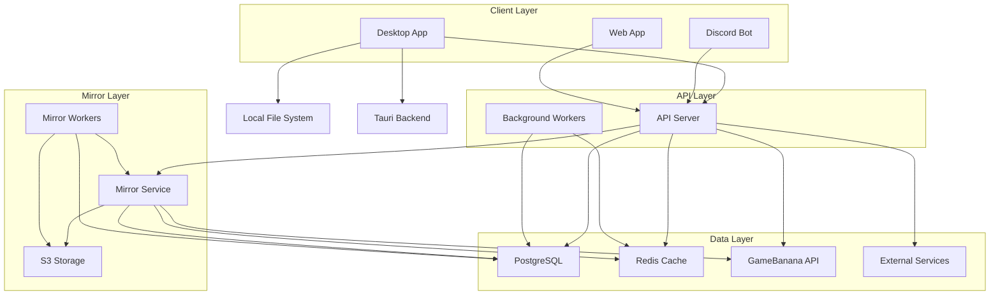
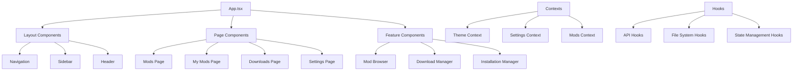
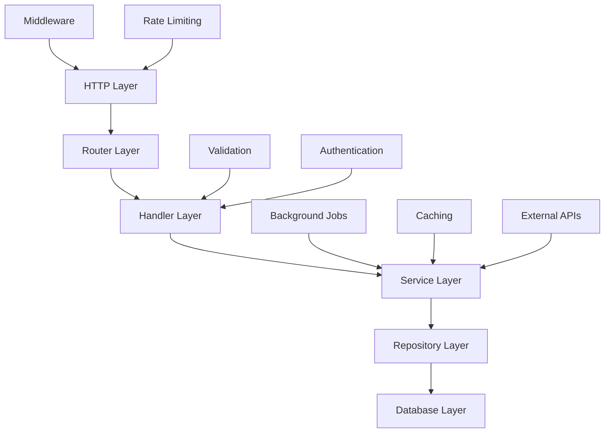
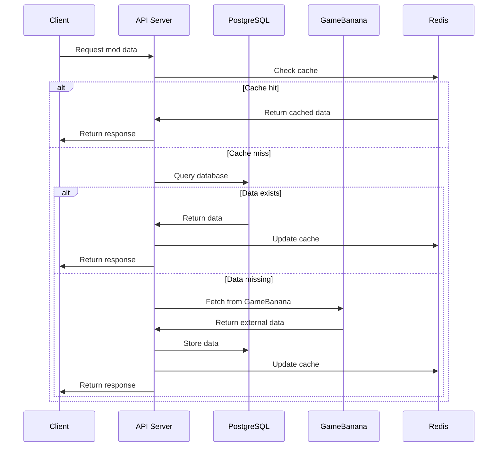
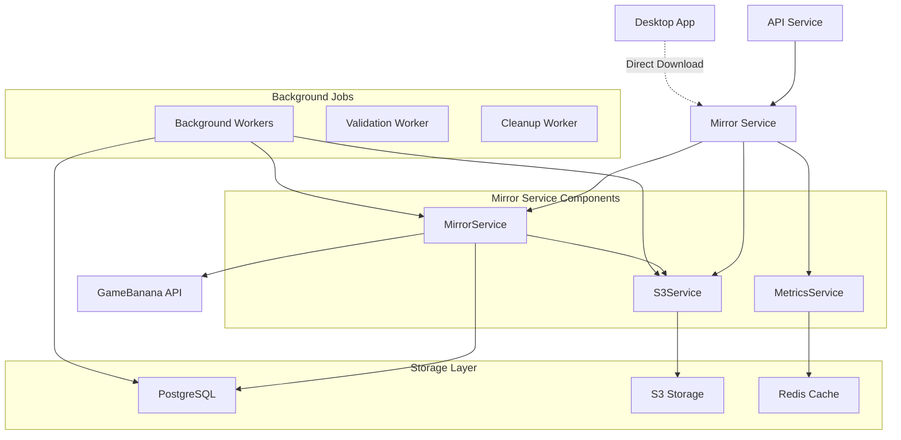
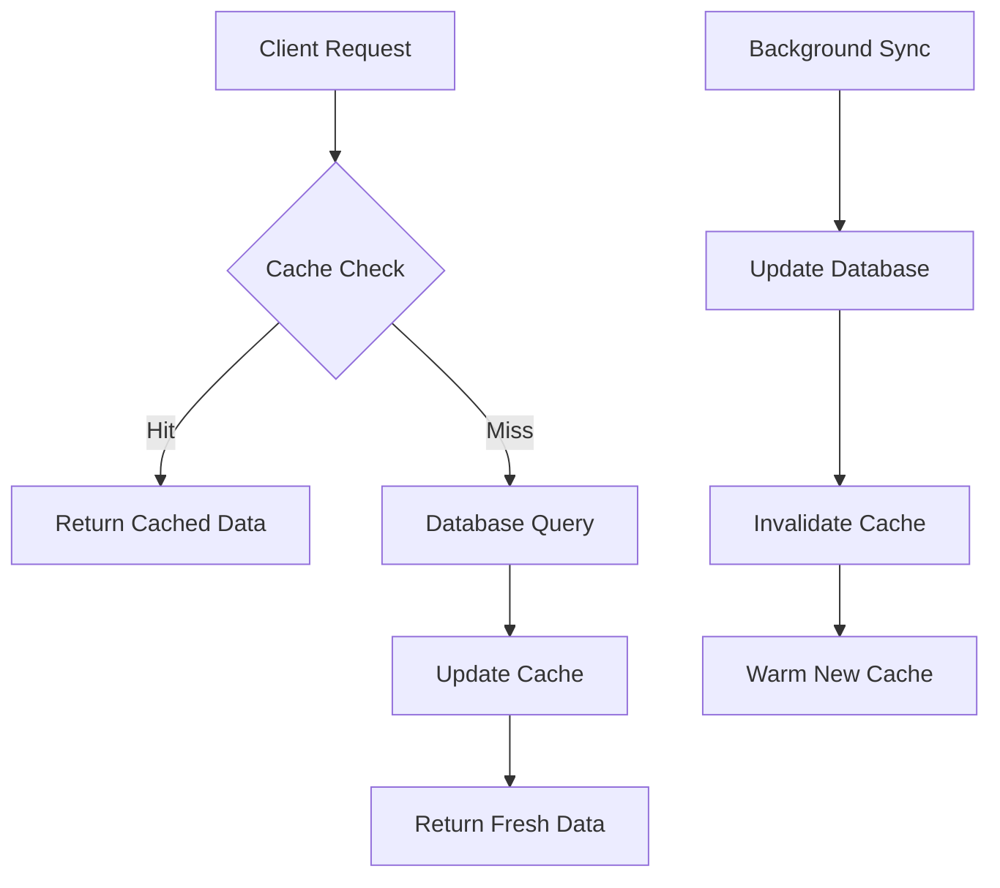

import { Card, Cards } from "fumadocs-ui/components/card";
import { Callout } from "fumadocs-ui/components/callout";

# Architecture Overview

Deadlock Mod Manager is built with a modern, scalable architecture that separates concerns effectively while maintaining performance and usability. This document explores the key architectural decisions and patterns used throughout the system.

## High-Level Architecture

### System Overview



### Core Components

#### 1. Desktop Application (Tauri + React)

- **Frontend**: React-based UI with TypeScript
- **Backend**: Rust-based Tauri application for system integration
- **Communication**: IPC between frontend and backend layers
- **File Management**: Direct file system access for mod installation

#### 2. API Service (Bun + Hono)

- **Data Synchronization**: Fetches mod data from GameBanana
- **Caching Layer**: Redis for performance optimization
- **Database**: PostgreSQL for persistent storage
- **Background Jobs**: Queue-based processing for heavy operations

#### 3. Mirror Service (Bun + Hono)

- **File Caching**: S3-backed caching layer for mod downloads
- **Performance Optimization**: Reduces load on GameBanana API
- **Bandwidth Savings**: Serves frequently accessed files from cache
- **Background Workers**: Automated validation and cleanup processes

For detailed information, see the [Mirror Service Documentation](/developer-docs/mirror-service).

#### 4. Shared Packages

- **Database Schema**: Centralized data models using Drizzle ORM
- **Logging**: Structured logging across all services
- **Common Utilities**: Shared business logic and types

## Desktop Application Architecture

### Frontend Architecture (React)



**Key Design Patterns:**

1. **Component Composition**: Large components are broken down into smaller, reusable pieces
2. **Context API**: Global state management for themes, settings, and mod data
3. **Custom Hooks**: Encapsulate complex logic for API calls, file operations, and state management
4. **Separation of Concerns**: UI components separate from business logic

### Backend Architecture (Tauri/Rust)

```
Desktop Backend (Rust)
├── File System Management
│   ├── Mod Installation
│   ├── File Validation
│   ├── Backup/Restore
│   └── Path Resolution
├── System Integration
│   ├── Game Detection
│   ├── Steam Integration
│   ├── OS-Specific Features
│   └── Security Permissions
├── API Communication
│   ├── HTTP Client
│   ├── Download Manager
│   ├── Progress Tracking
│   └── Error Handling
└── IPC Layer
    ├── Command Handlers
    ├── Event Emission
    ├── State Synchronization
    └── Error Propagation
```

**Core Responsibilities:**

- **File Operations**: Safe mod installation and management
- **System Integration**: Game detection and path management
- **Network Operations**: API communication and file downloads
- **Security**: Secure file operations with user permissions

## API Service Architecture

### Service Layer Design



**Layer Responsibilities:**

#### HTTP Layer

- Request/response handling
- CORS configuration
- Rate limiting
- Request logging

#### Router Layer

- Route definition and organization
- Path parameter extraction
- Route-specific middleware

#### Handler Layer

- Request validation
- Response formatting
- Error handling
- Authentication checks

#### Service Layer

- Business logic implementation
- External API integration
- Background job scheduling
- Cache management

#### Repository Layer

- Database query abstraction
- Data transformation
- Transaction management
- Query optimization

### Data Flow Architecture



## Mirror Service Architecture

The mirror service acts as a caching layer for mod file downloads, improving performance and reducing load on external APIs.

### High-Level Architecture



**Key Features:**

- **Smart Caching**: Automatically caches mod files on first download
- **Stream-Through Upload**: Files are streamed to client while uploading to S3
- **Stale Detection**: Background workers validate file integrity
- **Automatic Cleanup**: Removes unused files based on retention policy
- **Metrics Tracking**: Cache hit rates, bandwidth savings, and download statistics

For complete technical details and integration patterns, see the [Mirror Service Documentation](/developer-docs/mirror-service).

## Data Architecture

### Database Schema Design

Refer to the drizzle schema for the database schema.

**Design Principles:**

- **Normalized Structure**: Reduces data redundancy
- **Foreign Key Constraints**: Ensures data integrity
- **Indexing Strategy**: Optimized for common query patterns
- **Privacy-First**: No personally identifiable information stored

### Caching Strategy



**Cache Layers:**

1. **Application Cache**: In-memory caching for frequently accessed data
2. **Redis Cache**: Distributed caching for API responses
3. **Browser Cache**: Client-side caching for UI resources

## Security Architecture

### Desktop Application Security

#### File System Security

- **Sandboxed Operations**: All file operations go through Tauri's secure API
- **Permission Model**: Explicit permissions for file system access
- **Path Validation**: All paths validated before operations
- **Backup Strategy**: Automatic backups before destructive operations

#### Network Security

- **HTTPS Only**: All network requests use TLS encryption
- **Request Validation**: All API responses validated before use
- **Rate Limiting**: Protection against abuse

<Cards>
  <Card
    title="Contributing Guidelines"
    description="Learn how to contribute to the project architecture"
    href="/tech-guide/contributing"
  />
  <Card
    title="API Reference"
    description="Detailed API documentation for developers"
    href="/tech-guide/api-reference"
  />
  <Card
    title="Development Setup"
    description="Set up your development environment"
    href="/tech-guide/development-setup"
  />
</Cards>

<Callout type="info" title="Architecture Questions?">
  If you have questions about architectural decisions or want to propose
  improvements, please join our [Discord
  community](https://discord.gg/WbFNt8CCr8) or [create an
  issue](https://github.com/stormix/deadlock-modmanager/issues) for discussion.
</Callout>
