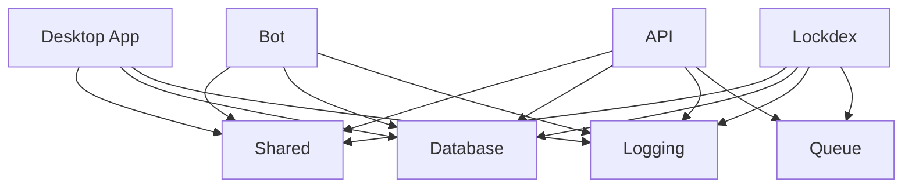

import { Card, Cards } from "fumadocs-ui/components/card";
import { Callout } from "fumadocs-ui/components/callout";

# Project Structure

Deadlock Mod Manager is organized as a monorepo using pnpm workspaces, built with modern technologies and following established patterns for maintainability and scalability.

## Overview

The project follows a clear separation between applications, shared packages, and development tools:

```
deadlock-modmanager/
├── apps/                    # Applications
│   ├── api/                # Backend API service
│   ├── bot/                # Discord bot
│   ├── desktop/            # Main Tauri desktop app
│   ├── docs/               # Documentation site
│   ├── lockdex/            # Lockdex service
│   └── www/                # Marketing website
├── packages/               # Shared packages
│   ├── common/             # Common utilities
│   ├── database/           # Database schema & client
│   ├── distributed-lock/   # Utilities for distributed locking
│   ├── feature-flags/      # Feature flag system
│   ├── instrumentation/    # Observability tools
│   ├── logging/            # Structured logging
│   ├── queue/              # Queue management
│   ├── shared/             # Shared types & utilities
│   └── vpk-parser/         # VPK file parsing (Rust)
├── tools/                  # Development tools
│   └── typescript/         # Shared TypeScript configs
└── .cursor/                # Development rules & docs
```

## Applications (`apps/`)

### Desktop App (`apps/desktop/`)

The main Tauri-based desktop application - the primary user interface for the mod manager.

```
apps/desktop/
├── src/                    # React frontend source
│   ├── components/         # React components (118 files)
│   ├── pages/              # Application pages/routes
│   ├── hooks/              # Custom React hooks (32 files)
│   ├── contexts/           # React contexts
│   ├── lib/                # Utility libraries (19 files)
│   ├── locales/            # Internationalization files
│   └── types/              # TypeScript type definitions
├── src-tauri/              # Rust backend
│   ├── src/                # Rust source code (18 files)
│   ├── icons/              # Application icons
│   ├── capabilities/       # Tauri security capabilities
│   └── tauri.conf.json     # Tauri configuration
├── public/                 # Static assets
└── dist/                   # Built application
```

**Key Technologies:**

- **Frontend**: React 18 + TypeScript + Tailwind CSS v4
- **Backend**: Tauri v2 with Rust
- **State Management**: React Context + hooks
- **Styling**: Tailwind CSS v4 with custom design system
- **Build**: Vite for frontend, Cargo for Rust

### API Service (`apps/api/`)

Backend API service that synchronizes mod data from GameBanana and serves it to clients.

```
apps/api/
├── src/
│   ├── config/             # Application configuration
│   ├── handlers/           # Request handlers (2 files)
│   ├── lib/                # Utility libraries (8 files)
│   ├── processors/         # Data processing logic (2 files)
│   ├── providers/          # External service providers (4 files)
│   ├── routers/            # API route definitions (14 files)
│   ├── services/           # Business logic services (9 files)
│   ├── types/              # TypeScript type definitions (2 files)
│   └── validation/         # Request validation schemas (6 files)
└── dist/                   # Built application
```

**Key Technologies:**

- **Runtime**: Bun for high performance
- **Framework**: Hono for lightweight HTTP server
- **Validation**: Zod for type-safe validation
- **Database**: PostgreSQL with Drizzle ORM
- **Observability**: Structured logging with Sentry

### Discord Bot (`apps/bot/`)

Discord bot for community integration and notifications. Built with Sapphire and Discord.js.

```
apps/bot/
├── src/
│   ├── commands/           # Discord slash commands
│   ├── listeners/          # Event listeners
│   ├── services/           # Bot services (4 files)
│   └── lib/                # Utility libraries (9 files)
└── dist/                   # Built application
```

**Key Technologies:**

- **Runtime**: Bun
- **Library**: Discord.js
- **Database**: Shared database package

### Documentation Site (`apps/`)

This documentation site built with Fumadocs and Next.js.

```
apps/
├── content/           # Documentation content
│   ├── user-guide/         # User documentation
│   ├── tech-guide/         # Technical documentation
│   └── index.mdx           # Documentation homepage
├── src/
│   ├── app/                # Next.js app router pages
│   └── lib/                # Utility libraries
└── public/                 # Static assets
```

**Key Technologies:**

- **Framework**: Next.js 14 with App Router
- **Documentation**: Fumadocs for MDX processing
- **Styling**: Tailwind CSS
- **Content**: MDX for documentation pages

### Other Applications

#### Lockdex Service (`apps/lockdex/`)

Service for managing Deadlock game data and indexing.

#### Marketing Website (`apps/www/`)

Public-facing website for project information and downloads.

## Shared Packages (`packages/`)

### Database Package (`packages/database/`)

Centralized database schema and client using Drizzle ORM.

```
packages/database/
├── src/
│   ├── schema/             # Database schema definitions
│   ├── migrations/         # Database migrations
│   ├── seed/               # Database seeding
│   └── client.ts           # Database client configuration
└── drizzle.config.ts       # Drizzle configuration
```

**Features:**

- PostgreSQL with type-safe queries
- Automatic migration generation
- Seed data for development
- Connection pooling and optimization

### Logging Package (`packages/logging/`)

Structured logging system with context support and Sentry integration.

```
packages/logging/
├── src/
│   ├── logger.ts           # Core logger implementation
│   ├── context.ts          # Async context support
│   ├── formatters/         # Log formatters
│   └── types.ts            # Type definitions
└── README.md               # Usage documentation
```

**Features:**

- Environment-aware formatting
- Request-scoped context
- Error tracking integration
- Type-safe log methods

### Shared Utilities (`packages/shared/`)

Common utilities and type definitions used across applications.

```
packages/shared/
├── src/
│   ├── types/              # Shared TypeScript types
│   ├── utils/              # Utility functions
│   ├── constants.ts        # Application constants
│   └── validators/         # Shared validation schemas
└── CHANGELOG.md
```

### VPK Parser (`packages/vpk-parser/`)

Rust-based package for parsing Valve VPK (Valve Pak) files with TypeScript bindings.

```
packages/vpk-parser/
├── src/                    # TypeScript bindings
├── src-rs/                 # Rust implementation (4 files)
├── test/                   # Test files
├── Cargo.toml              # Rust dependencies
└── package.json            # npm package configuration
```

**Features:**

- Native Rust performance for file parsing
- TypeScript bindings using napi-rs
- Comprehensive VPK format support
- Memory-efficient streaming parsing

### Queue System (`packages/queue/`)

Queue management system for background job processing.

```
packages/queue/
├── src/
│   ├── queues/             # Queue implementations
│   ├── workers/            # Worker processes
│   ├── jobs/               # Job definitions
│   └── scheduler.ts        # Job scheduling
└── README.md
```

### Other Packages

- **`packages/common/`**: Common error handling and utilities
- **`packages/distributed-lock/`**: Distributed locking mechanisms
- **`packages/feature-flags/`**: Feature flag management
- **`packages/instrumentation/`**: Observability and monitoring tools

## Development Tools (`tools/`)

### TypeScript Configuration (`tools/typescript/`)

Shared TypeScript configurations for consistent typing across the monorepo.

```
tools/typescript/
├── base.json               # Base TypeScript config
├── nextjs.json             # Next.js specific config
└── package.json
```

## Configuration Files

### Root Level Configuration

- **`pnpm-workspace.yaml`**: Workspace configuration for pnpm
- **`turbo.json`**: Turborepo configuration for build optimization
- **`biome.jsonc`**: Biome linting and formatting configuration
- **`lefthook.yml`**: Git hooks for pre-commit checks
- **`compose.yml`**: Docker Compose for local development
- **`.gitignore`**: Version control ignore patterns

### Development Rules (`.cursor/`)

Project-specific development guidelines and rules:

```
.cursor/
├── rules/
│   ├── 010-workflow.mdc            # Workflow guidelines
│   ├── 020-codebase-structure.mdc  # Structure documentation
│   ├── 030-coding-style.mdc        # Coding standards
│   ├── 040-logging.mdc             # Logging guidelines
│   ├── 050-tauri-version.mdc       # Tauri v2 enforcement
│   └── 060-tailwind-v4.mdc         # Tailwind CSS v4 guidelines
```

## Key Technologies & Patterns

### Frontend Technologies

- **React 18**: Modern React with hooks and concurrent features
- **TypeScript**: Strict typing throughout the codebase
- **Tailwind CSS v4**: Utility-first styling with custom configuration
- **Vite**: Fast development and building
- **Tauri v2**: Native desktop capabilities with web technologies

### Backend Technologies

- **Bun**: High-performance JavaScript runtime
- **Hono**: Lightweight web framework
- **PostgreSQL**: Robust relational database
- **Drizzle ORM**: Type-safe database queries
- **Redis**: Caching and session storage

### Development Tools

- **pnpm**: Fast, disk space efficient package manager
- **Turborepo**: Monorepo build system with caching
- **Biome**: Fast linter and formatter
- **Lefthook**: Git hooks for quality assurance
- **Docker**: Containerized development environment

## Architectural Patterns

### Monorepo Organization

The project uses several patterns for effective monorepo management:

1. **Clear Separation**: Apps vs packages vs tools
2. **Dependency Direction**: Apps depend on packages, not vice versa
3. **Shared Configurations**: TypeScript, linting, and formatting configs
4. **Build Orchestration**: Turborepo for efficient builds and caching

### Type Safety

The project emphasizes type safety:

- **No `any` types**: Strict TypeScript configuration
- **Branded types**: Enhanced type safety for domain objects
- **Schema validation**: Zod for runtime type checking
- **Database types**: Generated from schema definitions

### Error Handling

Consistent error handling patterns:

- **Structured errors**: Common error types and handling
- **Logging integration**: All errors are properly logged
- **User-friendly messages**: Meaningful error messages for users
- **Development aids**: Detailed error information in development

## Package Dependencies

### Dependency Flow



### Key Dependencies

Each package has specific responsibilities:

- **Apps**: Consume packages, provide user interfaces
- **Packages**: Provide shared functionality, business logic
- **Tools**: Development and build-time utilities

## Working with the Structure

### Adding New Features

1. **Determine scope**: App-specific or shared functionality?
2. **Choose location**: Appropriate app or package directory
3. **Follow patterns**: Use existing patterns for consistency
4. **Update dependencies**: Add to appropriate package.json files

### Adding New Packages

1. **Create package directory**: Under `packages/`
2. **Initialize package.json**: With appropriate metadata
3. **Add to workspace**: Update `pnpm-workspace.yaml` if needed
4. **Export properly**: Ensure clean public API

### Refactoring

1. **Identify shared code**: Look for duplication across apps
2. **Extract to packages**: Move shared code to appropriate packages
3. **Update imports**: Use workspace references (`@deadlock-mods/*`)
4. **Test thoroughly**: Ensure all apps still work correctly

## Next Steps

<Cards>
  <Card
    title="Architecture Guide"
    description="Deep dive into system architecture and design decisions"
    href="/tech-guide/architecture"
  />
  <Card
    title="Contributing Guidelines"
    description="Learn how to contribute effectively to the project"
    href="/tech-guide/contributing"
  />
  <Card
    title="API Reference"
    description="Detailed API documentation for developers"
    href="/tech-guide/api-reference"
  />
</Cards>

<Callout type="info" title="Questions About Structure?">
  If you have questions about the project structure or need help understanding
  how components fit together, feel free to ask in our [Discord
  community](https://discord.gg/WbFNt8CCr8) or [create an
  issue](https://github.com/stormix/deadlock-modmanager/issues) on GitHub.
</Callout>
