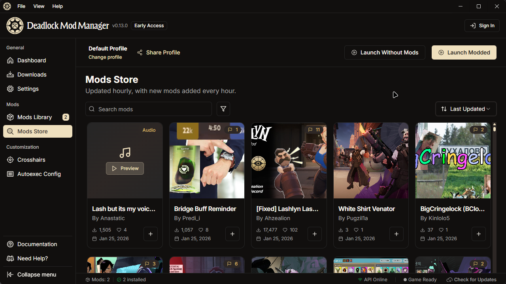

<!-- Improved compatibility of back to top link: See: https://github.com/othneildrew/Best-README-Template/pull/73 -->

<a id="readme-top"></a>

<div align="center">
<h1> Deadlock Mod Manager</h1>
</div>
<p align="center">
  <a href="../../../README.md">English</a> | <a href="./README.md">简体中文</a>
</p>
<!-- Project Stats -->
<div align="center">

[![Downloads][downloads-status]][downloads-url]
[![Contributors][contributors-status]][contributors-url]
[![GitHub Release][release-status]][release-url]
[![GitHub Issues or Pull Requests][issues-status]][issues-url]
[](https://uptime.betterstack.com/?utm_source=status_badge)
[](https://deepwiki.com/deadlock-mod-manager/deadlock-mod-manager)
[](https://crowdin.com/project/deadlock-mod-manager)
[![License][license-status]][license-url]

[![Built with Tauri][tauri-status]][tauri-url]

</div>
<br />
<div align="center">
  <a href="https://github.com/deadlock-mod-manager/deadlock-mod-manager">
    
  </a>

  <h3 align="center">Deadlock Mod Manager</h3>

  <p align="center">
    一个用于 Valve 游戏《Deadlock》的模组管理器，基于 Tauri、React 和 TypeScript 构建。
    <br />
    <br />
    <a href="https://github.com/deadlock-mod-manager/deadlock-mod-manager/releases/latest">下载</a>
    ·
    <a href="https://docs.deadlockmods.app/">文档</a>
    ·
    <a href="https://github.com/deadlock-mod-manager/deadlock-mod-manager/issues/new?labels=bug&template=bug-report---.md">报告 Bug</a>
    ·
    <a href="https://github.com/deadlock-mod-manager/deadlock-mod-manager/issues/new?labels=enhancement&template=feature-request---.md">请求新功能</a>
  </p>
  
<!-- Distribution & Platforms -->
[![Windows][windows-status]][windows-url]
[![Linux][linux-status]][linux-url]
[![AUR][aur-status]][aur-url]

  <a id="screenshots"></a>
  
  
</div>

<!-- TABLE OF CONTENTS -->
<details>
  <summary>目录</summary>
  <ol>
    <li><a href="#screenshots">截图</a></li>
    <li><a href="#usage">使用方式</a></li>
    <li><a href="#sponsors">赞助商</a></li>
    <li><a href="#whats-inside">内部包含什么？</a></li>
    <li><a href="#development">开发</a></li>
    <li><a href="#translation--localization">翻译与本地化</a></li>
    <li><a href="#contributing">贡献</a></li>
    <li><a href="#license">许可证</a></li>
    <li><a href="#contact">联系方式</a></li>
    <li><a href="#acknowledgments">致谢</a></li>
  </ol>
</details>

<a id="usage"></a>

## 使用方式

有关详细的安装说明、入门指南、故障排查和功能文档，请访问我们的完整文档：

**[玩家指南](https://docs.deadlockmods.app/using-mod-manager)** - 安装、使用和故障排查

如需帮助和支持：

- [完整文档](https://docs.deadlockmods.app/)
- [Discord 社区](https://deadlockmods.app/discord)
- [报告问题](https://github.com/deadlock-mod-manager/deadlock-mod-manager/issues)

> [!WARNING]
> **Linux 支持 - 有限**
>
> Linux 支持按**尽力而为**的原则提供。由于缺乏具备 Linux 专业知识的贡献者，以及维护者在众多 Linux 发行版上的分发经验有限，你可能会遇到打包问题、依赖缺失或特定平台的 Bug。如果你是 Linux 用户并且希望帮助改进支持，非常欢迎贡献！请在 [Discord](https://deadlockmods.app/discord) 上联系我们或提交 PR。

> [!NOTE]
> **AUR 版本暂时无法获取**
>
> 我们目前无法将新版本推送到 [AUR](https://aur.archlinux.org/packages/deadlock-modmanager) 软件包。截至 2026 年 7 月下旬，Arch Linux 团队在调查一波恶意软件包接管事件期间（已移除超过 1,500 个被感染的软件包），限制了 AUR 软件包的接管及相关 git 写入权限。在这些限制解除之前，AUR 软件包可能会落后于 GitHub 版本。在此期间，请从 [GitHub Releases](https://github.com/deadlock-mod-manager/deadlock-mod-manager/releases/latest) 页面下载最新的 Linux 构建版本。

<br />

<a id="sponsors"></a>

## 赞助商

<p align="center">
  <a href="https://neon.com/?utm_source=deadlock-mod-manager&utm_medium=github&utm_campaign=sponsor">
    
  </a>
</p>

<p align="center">
  无服务器 PostgreSQL 由 <a href="https://neon.com/?utm_source=deadlock-mod-manager&utm_medium=github&utm_campaign=sponsor">Neon</a> 提供。感谢赞助 Deadlock Mod Manager！
</p>

<br/>

<p align="center">
  <a href="https://signpath.io/?utm_source=foundation&utm_medium=github&utm_campaign=deadlock-mod-manager">
    
  </a>
</p>

<p align="center">
  Windows 上的免费代码签名由 <a href="https://signpath.io/?utm_source=foundation&utm_medium=github&utm_campaign=deadlock-mod-manager">SignPath.io</a> 提供<br/>
  证书由 <a href="https://signpath.org/?utm_source=foundation&utm_medium=github&utm_campaign=deadlock-mod-manager">SignPath Foundation</a> 签发
</p>

<br/>

<p align="center">
  <a href="https://crabnebula.dev/?utm_source=deadlock-mod-manager&utm_medium=github&utm_campaign=sponsor">
    
  </a>
</p>

<p align="center">
  Tauri 工具链与分发基础设施由 <a href="https://crabnebula.dev/?utm_source=deadlock-mod-manager&utm_medium=github&utm_campaign=sponsor">CrabNebula</a> 提供。感谢赞助 Deadlock Mod Manager！
</p>

<br/>

<p align="center">
  <a href="https://depot.dev/?utm_source=deadlock-mod-manager&utm_medium=github&utm_campaign=sponsor">
    
  </a>
</p>

<p align="center">
  更快的 CI 构建由 <a href="https://depot.dev/?utm_source=deadlock-mod-manager&utm_medium=github&utm_campaign=sponsor">Depot</a> 提供。感谢赞助 Deadlock Mod Manager！
</p>

<p align="right">(<a href="#readme-top">返回顶部</a>)</p>

<a id="development"></a>

## 开发

有关开发环境搭建、项目架构、贡献指南和 API 集成文档，请访问：

- **[开发者文档](https://docs.deadlockmods.app/developer-docs)** - 开发环境搭建与架构
- **[API 参考](https://docs.deadlockmods.app/api)** - 交互式 API 文档

### 使用 Nix 进行开发（仅限 Linux）

[](https://nixos.org)

对于 Linux 开发者，我们提供完整的 Nix 开发环境：

```bash
# 克隆并进入项目
git clone https://github.com/deadlock-mod-manager/deadlock-mod-manager.git
cd deadlock-mod-manager

# 启动开发 shell（或使用 direnv 自动加载）
nix develop

# 安装依赖并启动
pnpm install
pnpm desktop:dev
```

Nix 环境包含你所需的一切：Rust、Node.js、pnpm、Docker、系统库以及所有开发工具。

有关详细的 Nix 环境搭建说明，请参阅 [CONTRIBUTING.md](./CONTRIBUTING.md#development-with-nix)。

<a id="translation--localization"></a>

## 翻译与本地化

🌍 **帮助我们翻译 Deadlock Mod Manager！**

我们正积极致力于让全球用户都能使用 Deadlock Mod Manager。加入我们的翻译工作，把这个模组管理器带到你的语言中！

<details>
  <summary><strong>当前支持的语言</strong></summary>

<!-- LANGUAGE_TABLE_START -->

| 语言 | 母语名称 | 状态 | 贡献者 |
|----------|-------------|--------|-------------|
| 🇺🇸 **英语**（默认） | English | ✅ 已完成 | - |
| 🇧🇬 **保加利亚语** | Български | 🚧 14% | [macchiako](https://discordapp.com/users/macchiako./) |
| 🇧🇾 **白俄罗斯语** | Беларуская | 🚧 进行中 | [drodn](https://discordapp.com/users/drodn/) |
| 🇩🇪 **德语** | Deutsch | 🚧 32% | [skeptic](https://github.com/Skeptic-systems) |
| 🇫🇷 **法语** | Français | 🚧 22% | [stormix](https://github.com/stormix) |
| 🇷🇺 **俄语** | Русский | 🔴 0% | [awkward_akio](https://discordapp.com/users/awkward_akio/), [Thyron](https://github.com/baka-thyron) |
| 🇸🇦 **阿拉伯语** | العربية | 🚧 32% | [archeroflegend](https://discordapp.com/users/archeroflegend/) |
| 🇵🇱 **波兰语** | Polski | 🚧 68% | [_manio](https://discordapp.com/users/_manio/) |
| 🇨🇭 **瑞士德语** | Schwiizerdütsch | 🚧 15% | [degoods_deedos](https://discordapp.com/users/degoods_deedos/) |
| 🇹🇭 **泰语** | ไทย | 🚧 23% | [altqx](https://discordapp.com/users/altq/) |
| 🇹🇷 **土耳其语** | Türkçe | 🚧 18% | [kenanala](https://discordapp.com/users/kenanala/) |
| 🇨🇳 **简体中文** | 简体中文 | 🚧 80% | [待到春深方挽柳](mailto:sfk_04@qq.com) |
| 🇹🇼 **繁体中文** | 繁體中文 | ✅ 已完成 | [白雲](https://github.com/phillychi3) |
| 🇪🇸 **西班牙语** | Español | ✅ 已完成 | [chikencio](https://discordapp.com/users/chikencio/) |
| 🇧🇷 **葡萄牙语（巴西）** | Português (Brasil) | 🚧 20% | [meneee](https://discordapp.com/users/meneee/) |
| 🇮🇹 **意大利语** | Italiano | 🚧 21% | [Constrat](https://github.com/Constrat) |
| 🇯🇵 **日语** | 日本語 | 🚧 31% | [hiropiki](https://discordapp.com/users/hiropiki/) |
| 🇰🇷 **韩语** | 한국어 | 🚧 46% | [Quinnly_IRL](https://discordapp.com/users/Quinnly_IRL/) |

<!-- LANGUAGE_TABLE_END -->
</details>

### 如何提供帮助

所有翻译都在 **[Crowdin](https://translate.deadlockmods.app/)** 上管理。翻译结果会通过 [Crowdin GitHub action](../../../.github/workflows/crowdin.yml) 自动同步回本仓库，因此你无需直接编辑 JSON 文件。

1. **在 Crowdin 上翻译**：前往 [translate.deadlockmods.app](https://translate.deadlockmods.app/) 并选择你的语言 - 审核通过的翻译会自动作为 PR 提交
2. **加入我们的 Discord 服务器**：[加入 Discord 服务器](https://deadlockmods.app/discord)，并在 [#translations](https://discord.com/channels/1322369530386710568/1414203136939135067) 频道进行协调
3. **建议新增语言**：在 Crowdin 上发起请求，如果列表中没有该语言，也可以[提交 issue](https://github.com/deadlock-mod-manager/deadlock-mod-manager/issues/new)

翻译文件位于 `apps/desktop/src/locales/`，通过 [react-i18next](https://react.i18next.com/) 加载。仓库中只直接编辑 `en.json`；所有其他语言环境都通过 Crowdin 管理。

<a id="contributing"></a>

## 贡献

贡献让开源社区成为一个学习、启发和创造的绝佳场所。你所做的任何贡献都**非常值得感谢**。

如需全面的贡献指南、开发环境搭建、代码风格规范与最佳实践，请参阅：

- **[CONTRIBUTING.md](./CONTRIBUTING.md)**
- **[贡献文档](https://docs.deadlockmods.app/developer-docs/contributing)**

> **AI 辅助贡献：** 我们欢迎 AI 辅助贡献！请查阅我们的 [AI 政策](./AI_POLICY.md)，了解关于披露和质量期望的指南。

### 主要贡献者：

<a href="https://github.com/deadlock-mod-manager/deadlock-mod-manager/graphs/contributors">
  
</a>

<p align="right">(<a href="#readme-top">返回顶部</a>)</p>

<a id="license"></a>

## 许可证

本项目采用 GNU 通用公共许可证 v3.0 授权 - 详见 [LICENSE.md](../../../LICENSE.md) 文件。

内嵌及复制引入的第三方源代码（vpkmerge、ValveResourceFormat、shadcn/ui 等）在 [THIRD-PARTY-NOTICES.md](../../../THIRD-PARTY-NOTICES.md) 中有记录。

**免责声明：** 本项目与 Valve Corporation 无关。《Deadlock》及 Deadlock 标志是 Valve Corporation 的注册商标。

<a id="contact"></a>

## 联系方式

- **项目仓库**：[GitHub](https://github.com/deadlock-mod-manager/deadlock-mod-manager)
- **问题与 Bug 报告**：[GitHub Issues](https://github.com/deadlock-mod-manager/deadlock-mod-manager/issues)
- **功能请求**：[GitHub Discussions](https://github.com/deadlock-mod-manager/deadlock-mod-manager/discussions)
- **Discord 社区**：[加入我们的 Discord](https://deadlockmods.app/discord)
- **作者**：[Stormix](https://github.com/Stormix)

如需支持与问题解答，请使用 GitHub Issues 或加入我们的 Discord 社区。我们随时乐意提供帮助！

<!-- ACKNOWLEDGMENTS -->

<a id="acknowledgments"></a>

## 致谢

这个项目的实现离不开优秀的开源社区，特别是：

### 特别感谢

- **[GameBanana](https://gamebanana.com/)** - 我们主要的模组来源，也是本应用的基石。GameBanana 提供了全面的模组数据库和 API，使得浏览、发现和下载 Deadlock 模组成为可能。没有他们出色的平台和社区驱动的内容，这个项目就不会存在。
- **[Jelloge/Deadlock-Rich-Presence](https://github.com/Jelloge/Deadlock-Rich-Presence)** - Discord 游戏状态显示的实现完全得益于这个项目及其为富文本状态映射 Deadlock 控制台日志事件的工作。
- **[vpkmerge](https://github.com/Slush97/vpkmerge)** - Mod Foundry 使用的 Source 2 纹理、KV3 和声音编解码器（MIT）。
- **[ValveResourceFormat](https://github.com/ValveResourceFormat/ValveResourceFormat)** - Source 2 资源格式研究，Foundry 的编解码器和模型预览改编自该项目（MIT）。
- **[RapidRAW](https://github.com/CyberTimon/RapidRAW/)** - 一个 Tauri 项目，启发了我们的 CI 流水线、Linux 优化以及打包/分发方案。感谢你们分享环境配置和最佳实践。

<details>
  <summary><strong>开源库</strong></summary>

**框架与构建**

- [React](https://react.dev/)
- [TypeScript](https://www.typescriptlang.org/)
- [Vite](https://vite.dev/)
- [Tauri](https://tauri.app/)
- [Turborepo](https://turbo.build/)
- [pnpm](https://pnpm.io/)

**后端**

- [Bun](https://bun.sh/)
- [Hono](https://hono.dev/)
- [oRPC](https://orpc.unnoq.com/)
- [Drizzle ORM](https://orm.drizzle.team/)
- [Zod](https://zod.dev/)

**UI 与样式**

- [shadcn/ui](https://ui.shadcn.com/)
- [Radix UI](https://www.radix-ui.com/)
- [Tailwind CSS](https://tailwindcss.com/)
- [Phosphor Icons](https://phosphoricons.com/)
- [React Icons](https://react-icons.github.io/react-icons/search)

**TanStack**

- [TanStack Query](https://tanstack.com/query)
- [TanStack Router](https://tanstack.com/router)
- [TanStack Table](https://tanstack.com/table)
- [TanStack Form](https://tanstack.com/form)
- [TanStack Virtual](https://tanstack.com/virtual)

**其他**

- [Sentry](https://sentry.io/)
- [react-i18next](https://react.i18next.com/)

</details>

<p align="right">(<a href="#readme-top">返回顶部</a>)</p>

[downloads-status]: https://img.shields.io/github/downloads/stormix/deadlock-modmanager/latest/total
[downloads-url]: https://github.com/deadlock-mod-manager/deadlock-mod-manager/releases/latest
[stars-status]: https://img.shields.io/github/stars/stormix/deadlock-modmanager
[stars-url]: https://github.com/deadlock-mod-manager/deadlock-mod-manager/stargazers
[release-status]: https://img.shields.io/github/v/release/stormix/deadlock-modmanager
[release-url]: https://github.com/deadlock-mod-manager/deadlock-mod-manager/releases/latest
[issues-status]: https://img.shields.io/github/issues/stormix/deadlock-modmanager
[issues-url]: https://github.com/deadlock-mod-manager/deadlock-mod-manager/issues
[license-status]: https://img.shields.io/github/license/stormix/deadlock-modmanager
[license-url]: https://github.com/deadlock-mod-manager/deadlock-mod-manager/blob/main/LICENSE.md
[aur-status]: https://img.shields.io/aur/version/deadlock-modmanager
[aur-url]: https://aur.archlinux.org/packages/deadlock-modmanager
[tauri-status]: https://img.shields.io/badge/built_with-Tauri-24C8DB?logo=tauri
[tauri-url]: https://tauri.app/
[typescript-status]: https://img.shields.io/badge/typescript-007ACC?logo=typescript&logoColor=white
[typescript-url]: https://www.typescriptlang.org/
[rust-status]: https://img.shields.io/badge/rust-000000?logo=rust&logoColor=white
[rust-url]: https://www.rust-lang.org/
[commit-activity-status]: https://img.shields.io/github/commit-activity/m/stormix/deadlock-modmanager
[commit-activity-url]: https://github.com/deadlock-mod-manager/deadlock-mod-manager/graphs/commit-activity
[last-commit-status]: https://img.shields.io/github/last-commit/stormix/deadlock-modmanager
[last-commit-url]: https://github.com/deadlock-mod-manager/deadlock-mod-manager/commits/main
[contributors-status]: https://img.shields.io/github/contributors/stormix/deadlock-modmanager
[contributors-url]: https://github.com/deadlock-mod-manager/deadlock-mod-manager/graphs/contributors
[forks-status]: https://img.shields.io/github/forks/stormix/deadlock-modmanager
[forks-url]: https://github.com/deadlock-mod-manager/deadlock-mod-manager/network/members
[windows-status]: https://img.shields.io/badge/Windows-0078D6?logo=windows&logoColor=white
[windows-url]: https://github.com/deadlock-mod-manager/deadlock-mod-manager/releases/latest
[linux-status]: https://img.shields.io/badge/Linux-FCC624?logo=linux&logoColor=black
[linux-url]: https://github.com/deadlock-mod-manager/deadlock-mod-manager/releases/latest
